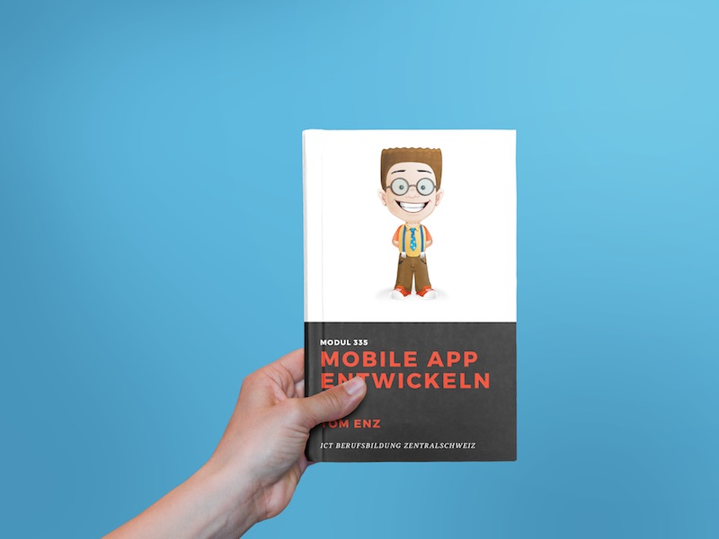

# Intro

## Modul 335

## Mobile App entwickeln

### Über dieses Script

Dieses Script wurde im Rahmen des Moduls 335 - Mobile Applikation realisieren für [ICT Berufsbildung Zentralschweiz ](http://ict-bz.ch) von Tom Enz erstellt. In 5 Tagen soll ein Überblick in die mobile Programmierung mit dem hybriden Framework Ionic gegeben werden. Dabei wird der Aufbau einer App, so wie auch die technische Umsetzung mit Angular angeschaut.

### Über Ralph

Heyy, mein Name ist Ralph!  
Ich bin die Person hinter Roomies, einem alten Schulprojekt und auch in diesem Script öfters mal anzutreffen. Du wirst mich bei Übungen oder an wichtigen Stellen mit einem Tipp finden. Freu mich dich zu sehen ...

