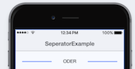

# FAQ

Hier findest du eine Sammlung der meist gestellten Fragen... ❓

## Wie kann ich meine App debuggen?

Hast du auch einen weissen Bildschirm oder deine Styling sieht nicht wie gewünscht aus? Dann wird es Zeit deine App mittels Entwicklerconsole zu debuggen:

> [Ionic: Architektur - Wie debugge ich meine App](https://modul-335.enz.lu/tag-1/ionic-architektur#wie-debugge-ich-meine-app)

## Wie kann ich ein Objekt zu einem Array hinzufügen?

Dies kann mittels `push` erreicht werden:

```javascript
export class MyArrayPage {
  myArr: any[];
  constructor(public navCtrl: NavController) {
      this.myArr.push({id: 1, name: "Zwei"});
  }
}
```

## Wie kann ich ein Seperator im UI machen?



Verwende dazu mehrere `<div>`'s und ein wenig CSS.

```markup
<ion-content no-scroll no-padding>
        <ion-grid>
            <ion-row>
                <ion-col col-4>
                    <div class="separator"></div>
                </ion-col>
                <ion-col col-4 text-center>
                    ODER
                </ion-col>
                <ion-col col-4>
                    <div class="separator"></div>
                </ion-col>
            </ion-row>
        </ion-grid>
</ion-content>
```

```css
.separator {
    background: color($colors, primary);
    height: 2px;
    margin-bottom: 10px !important;
    margin-top: 10px !important;
}
```

## Wie kann ich Werte zwischen einzelnen Pages mitgeben?

Oft generiert man sich dynamisch z.B. aus einer Datenbank eine Liste. Möchte man nun die Details eines Eintrags anzeigen und so auf eine Detail-Seite verweisen wird meist eine ID resp. das ganze Objekt mitgegeben. In Ionic funktioniert das mit sogenannten [Nav Params](https://ionicframework.com/docs/api/navigation/NavParams/).

## Runtime Error - Cannot find module

Wird dir folgende Meldung als Error angezeigt?

```text
Error: Cannot find module "angularfire2/auth"
```

Dann fehlt angularfire2 in deinen `node_modules`. Gehe dazu in deinen Projektordner und gib folgendes ein:

```text
npm install angularfire2 firebase --save
```

## Runtime Error - No component factory found

Wird dir folgende Meldung als Error angezeigt?

```text
Error: Uncaught (in promise): Error: No component factory found for ErsteSeitePage. Did you add it to @NgModule.entryComponents?
Error: No component factory found for ErsteSeitePage. Did you add it to @NgModule.entryComponents?
```

Du hast wohl vergessen `ErsteSeitePage` unter `entryComponents` in deinem `app.module.ts` hinzuzufügen.

## Runtime Error - Cannot read property ‘xyz’ of undefined

Ein klassischer Fehler welcher oft mit Objekten auftritt, aber nicht immer einfach zu finden ist. Dein Code sieht etwa so aus:

```javascript
// Inside your class
item: string;

// Inside your view
{{ item.myValue }}
```

Das Property selber ist nicht das Problem, jedoch das Objekt selber. Es wird versucht ein Property `myValue` des nicht vorhanden oder null Objekts `item` aufzurufen. Prüfe die initialiserung des Objekts oder verwende folgenden Code:

```javascript
// ? operator prevents crashing here!
{{ item?.myValue }}
```

## Runtime Error - Uncaught \(in promise\): invalid link: MyPage

Dieser Fehler tritt auf wenn du versuchst auf eine Seite MyPage zu navigieren, die nicht existiert. Hast du den Name richtig geschrieben?

## Runtime Error - \_co.myFunction is not a function

Dieser Fehler ist relativ einfach zu finden. Du rufst in deinem Template eine nicht definierte Funktion myFunction auf \(z.B. beim Klick eines Buttons\). Stelle sicher das in deiner Component die entsprechende Funktion auch definiert ist.

## Mein Code wird nicht angezeigt

Wird z.B. dein neuer Code nicht angezeigt:

```markup
<!-- welt.html
<ion-header>

    <ion-navbar>
        <ion-title>Welt</ion-title>
    </ion-navbar>

</ion-header>

<h1> Hallo Welt</h1>
<ion-content padding>

</ion-content>
```

In diesem Fall befindet sich das `<h1>`-Tag ausserhalb von `ion-content` oder `ion-header`, daher wird dies von Ionic nicht interpretiert.

Generell empfiehlt sich folgendes zu prüfen: 1\) Hast du deine Änderung gespeichert? 2\) Läuft dein `ionic serve` noch korrekt \(ohne Fehler\) resp. hast du den Befehl schon mal neu gestartet? 3\) Prüfe mittels Git deine Änderungen an den Dateien, findest du den Fehler so?

## Wie kann ich umgebungsspezifsche Variablen definieren \(z.B. für Produktion / Entwicklung\)?

Sobald deine App in den App-Store kommt, möchtest du z.B. `console.log` ausschalten oder eine andere URL brauchen.

Eine gute Anleitung um dies zu realisieren, findest du hier: [http://roblouie.com/article/296/ionic-2-environment-variables-the-best-way/](http://roblouie.com/article/296/ionic-2-environment-variables-the-best-way/)

