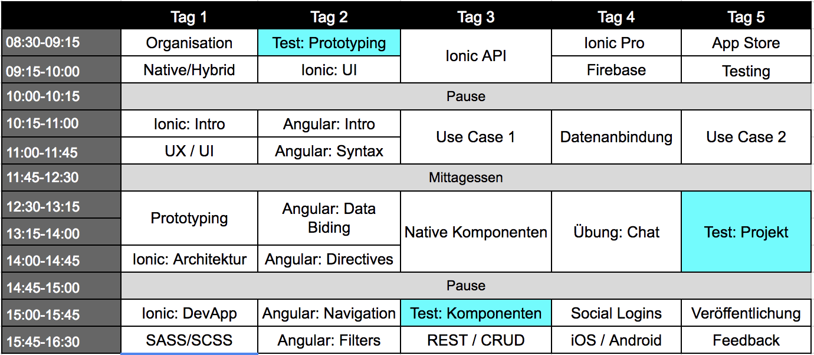

# Kursplanung

Dieser Kurs ist auf 5 Tage ausgelegt, ob diese Tage in einer Reihe oder auf verschiedene Wochen verteilt liegen spielt dabei keine Rolle. Die einzelnen Tage wurden in 45min-Blöcke unterteilt:  

