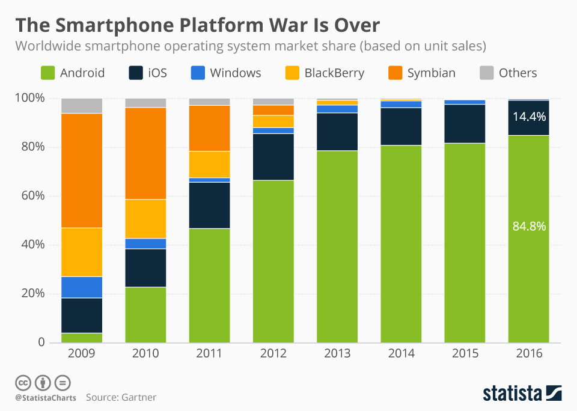

# Frameworks

## Mobile Betriebssysteme

Statcounter ist eine gute Website um die Marktanteile aufzuzeigen:



### Android

Android ist ein von Google zu Verfügung gestelltes mobiles Betriebssystem. Mehr dazu gibts hier:

[https://de.wikipedia.org/wiki/Android\_\(Betriebssystem\)](https://de.wikipedia.org/wiki/Android_%28Betriebssystem%29)

### iOS

Apple installiert auf seiner Produktlinie hauptsächlich ihr eigenes Betriebssystem iOS. Lies den kompletten Artikel hier:

[https://de.wikipedia.org/wiki/Apple\_iOS](https://de.wikipedia.org/wiki/Apple_iOS)

### Weitere

Wie ihr der Grafik oben entnehmen könnt, bleiben neben den zwei grossen Firmen Google und Apple kaum noch Hersteller von mobilen Betriebsystemen. Windows, Blackberry und co. sind praktisch weg vom Markt.

**Tipp von Ralph:**

> Orientiere dich als Entwickler am Markt.  
> Wenn du deine App für Android und iOS in den Store bringst, deckst du 98% aller Betriebssysteme ab. Setze den Fokus auf diese beiden Apps und kümmere dich erst später, wenn überhaupt noch um die anderen 2%.

## Begriff Framework

> Ein Framework \(englisch für Rahmenstruktur\) ist ein Programmiergerüst, das in der Softwaretechnik, insbesondere im Rahmen der objektorientierten Softwareentwicklung sowie bei komponentenbasierten Entwicklungsansätzen, verwendet wird. Im allgemeineren Sinne bezeichnet man mit Framework auch einen Ordnungsrahmen.

[https://de.wikipedia.org/wiki/Framework ](https://de.wikipedia.org/wiki/Framework)

Eine Liste der gängigsten Frameworks findest du unter folgendem Link.

[http://mobile-frameworks-comparison-chart.com ](http://mobile-frameworks-comparison-chart.com/)

Die Seite zeigt dir nicht nur die Unterschiede auf, sondern bietet dir und deinem Projekt gleich eine perfekte Hilfe bei der Wahl des richtigen Frameworks.

## Kurzübung

1. Geh auf die Website: [http://mobile-frameworks-comparison-chart.com](http://mobile-frameworks-comparison-chart.com)
2. Mach dich mit den Filtermöglichkeiten vertraut
3. Beantworte folgende Fragen für dich:
   1. Welche Frameworks kennst du schon?
   2. Welches würde dich interessieren? Warum?

