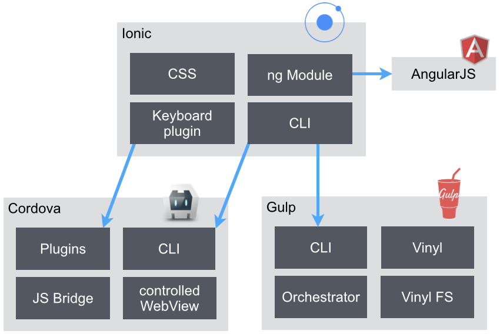
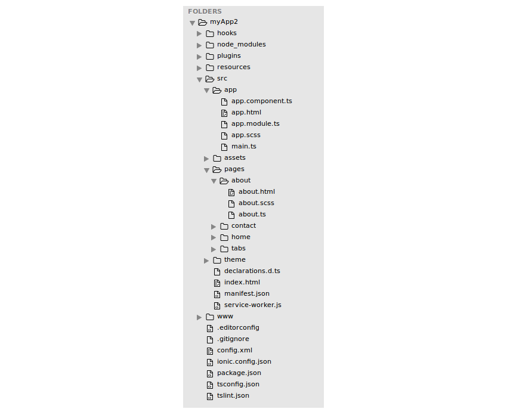
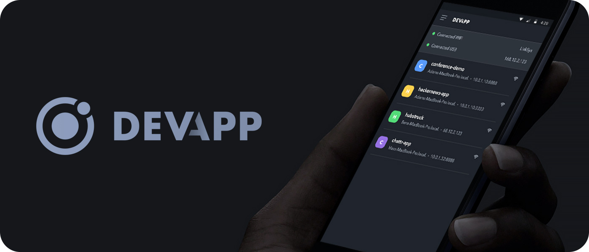

# Ionic: Architektur


Wie bereits erwähnt ist Ionic ein Framework welches sich die folgenden Technologien zu Nutze macht:

* HTML
* CSS
* JS

Dabei übernimmt Ionic auch die Kommunikation als JavaScript-Bridge mit Cordova dem eigentlichen Hybriden App Framework. Cordova wiederum greift auf die nativen API's des darunterliegenden Betriebssysteme \(iOS / Android\) zu.

Die Architektur von Ionic kann sogar noch etwas detaillierter aufgeteilt werden:



## Wichtige Dateien in der Projektstruktur

Um die richtigen Dateien in einer Projektstruktur zu finden, hilft dir folgende Aufstellung:



## Ionic Generator

Ionic hat seit CLI-Version 3.x den Generator eingeführt. Ein super Hilfsmittel um die wichtigsten Dinge per CLI generieren zu lassen. In der Struktur oben kannst du sehen, dass es z.B. im Verzeichnis _/app/pages/home_ immer 3 Dateien hat:

* HTML
* Typescript
* Styling \(SCSS\)

Möchten wir nun eine neue Seite z.B. Einstellungen \(settings\) zu unseren Projekt hinzufügen, könnten wir den Ordner _home_ duplizieren und ein mühsames Refactoring starten, oder die einfache Variante wählen und mit

```bash
ionic g page Settings
```

uns das ganze generieren lassen. Praktisch nicht?

Verschaff dir doch bitte in folgender Doku einen Überblick:  
[https://ionicframework.com/docs/cli/generate/](https://ionicframework.com/docs/cli/generate/)

## Ionic DevApp

DevApp ist eine 100% gratis App für iOS und Android, welche es dir ermöglicht deine Apps direkt auf deinem Mobiltelefon zu testen. Sie bietet eine perfekte Live-Ansicht deiner Änderungen und hat auch sehr vielen nativen Plugins bereits vorinstalliert.



Die App kann wie folgt mit der Ionic DevApp verwendet werden: 

```bash
ionic cordova prepare
ionic serve --devapp
```

## Wie debugge ich meine App?

HTML, CSS & JS sind cool oder? Ja, das denkt wohl jeder Entwickler bis er vor dem ersten wirklichen Problem steht.  
Hast du ein Fehler in deinem Typescript-Code, wird dich Ionic ziemlich nett darauf hinweisen. Manchmal passieren aber auch komische Dinge, dann heisst es analysieren. Hier einige Tipps von Ralph.

### HTML, CSS: Der Entwickler-Bereich deines Browsers

Alle grossen Browser verfügen heute über super Analyse-Tools und Console. Du findest Sie hier:

* Google Chrome: Entwickler Tools über Menu oder "Untersuchen" mit Rechtsklick auf der Seite
* Firefox: Inspector über Menu -&gt; Web-Entwickler oder "Element untersuchen" mit Rechtsklick auf der Seite
* Safari: Via Einstellungen -&gt; Erweitert -&gt; Entwickler-Modus

Du siehst deinen kompletten HTML DOM, also alles was ausgegeben wurde. Z.B. Wichtig um zu sehen ob deine Schleife funktioniert hat. Und auch das effektive Styling eines Elements, ob das richtige CSS zieht und woher die effektiven Werte kommen.

### Javascript: Der einfache Weg

Einer deiner besten Freunde wird sicher

```javascript
 console.log("Hallo ich bin Ralph!");
```

Du kannst so schon die wichtigsten Werte in deinem Code abfangen. Console.log erwartet einen String, du kannst aber auch eine Kombination machen und ein String + deine Zahl ausgeben. Dazu hier ein kleines Beispiel:

```text
 myNumber: any = 4;

 console.log("Nummer >> "+ myNumber);

 // Gibt auf der Console
 // Nummer >> 4
```

### Javascript: Der erweiterte Pfad

Console.log's sind praktisch, schnell und auch gut - aber sie geben dir nur eine entsprechende Ausgabe und sind meist viel zu schnell durch. Wie bei allen grossen Sprachen und IDE's kann man auch Typescript sauber Schritt für Schritt debuggen. Das Zauberwort, welches du in deinen Code schreiben musst heisst somit...  
Tadaaaa:

```javascript
  debugger;
```

\(so schwierig war das jetzt auch nicht, oder?\)

Mit dem `debugger;`-Befehl wird ein Projekt an jener Stelle angehalten und du kannst wiederum im Browser-Entwickler-Modus etwas genauer hinschauen. Probiers einmal aus, es lohnt sich

## Übung


1. Lade dir die DevApp auf dein Android oder iOS Gerät runter
2. Logge dich mit deinem Ionic Account ein
3. Folge den Anweisungen auf deinem Handy und probiere DevApp aus


## Capacitor



```bash
# Installieren
npm install --save @capacitor/core @capacitor/cli
npx cap init

# Projekt kompillieren
ionic build

# Plattform hinzufügen
npx cap add ios
# oder
npx cap add android


# App öffnen
npx cap open ios
npx cap open android

```

