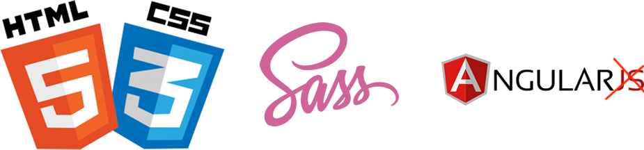
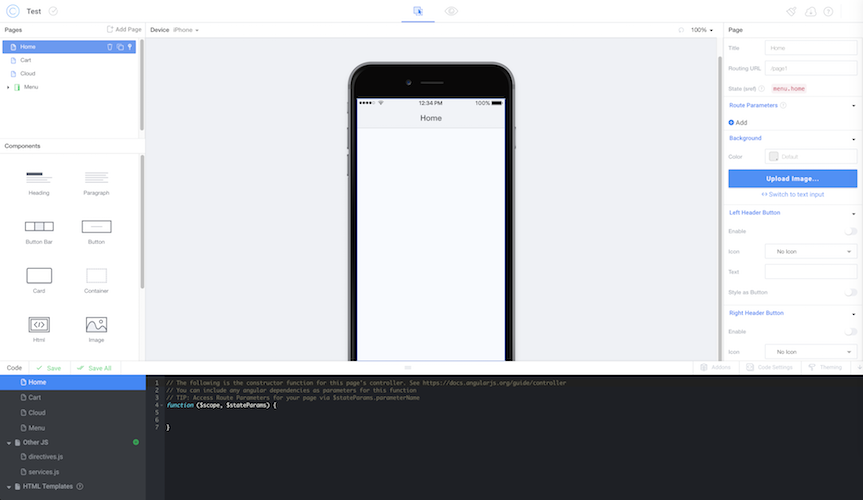

# Ionic: Intro

> Ionic ist ein Open-Source-Framework zur Erstellung von Hybrid-Apps auf der Basis von HTML5, CSS, Sass und JavaScript. Dabei basiert es auf Angular und Apache Cordova. Es stellt eine Programmbibliothek aus verschiedenen Komponenten zur Verfügung, mit denen interaktive Apps programmiert werden können. Der Fokus des Frameworks liegt auf der Seite des Front-Ends, also der Benutzerschnittstelle

[Wikipedia - Ionic Framework](https://enz.lu/7t)


## Website

Ionic ist unter folgender Website zu finden:  
[http://ionicframework.com/](http://ionicframework.com/)

### Welche Apps wurden mit Ionic erstellt?

Das Framework wird immer beliebter, im Showcase \(deutsch. Schaufenster\) sind einige coole Apps zu sehen:

[http://showcase.ionicframework.com/apps/top](http://showcase.ionicframework.com/apps/top)


## Technologien



Ionic basiert und verwendet:

* [HTML5](https://de.wikipedia.org/wiki/HTML5)
* [CSS](https://de.wikipedia.org/wiki/Cascading_Style_Sheets)
* [SASS](http://sass-lang.com/)
* [Angular](https://angular.io/) \(Typescript\)

Geh auf die Links oben und schau dir die Technologien etwas genauer an...

## Ionic Version ?

Ionic 1.x war die erste, sehr gute produktiv verwendbare Version von Ionic. 1.x ist jedoch inzwischen deprecated \(wird nicht weiterentwickelt\) und somit sind Ionic 2, 3 und 4 die direkten Nachfolger.

## Dokumentation

Handbücher und Bedienungsanleitung liest niemand und verstauben doch nur oder? Richtig, daher ist die Ionic Doku auch elektronisch und hier zu finden:  
[https://ionicframework.com/docs/](https://ionicframework.com/docs/)

Du findest dort sehr anschauliche Beispiele fürs Styling deiner App, gute Codebeispiele für native Komponenten und vieles mehr.

## Ionic Creator

Ionic bietet eine eigene, kostenpflichtige IDE namens [Creator](https://creator.ionic.io/app/login) an. Im letzten Jahr wurde [Ionic Creator](https://creator.ionic.io/app/login) in diesem ÜK's mit allen Vor- & Nachteilen noch verwendet.

  
Wir verwenden in diesem Kurs aber die lokale Entwicklungsumgebung rund um Ionic CLI, damit könnt ihr auch nach diesen 5 Kurstagen noch weiter an Euren Apps ~~basteln~~ programmieren.

## Ionic Command Line Interface


Die [Ionic CLI](https://ionicframework.com/docs/cli/) ist bester Helfer für die künftige Entwicklung mit Ionic. Wir Wissen, aller Anfang ist schwer, aber wie wärs mit

```bash
ionic
```

in deinem Terminal/Gitbash einzugeben.

### Wie erstelle ich ein neues Projekt

Ein neues Projekt erstellt du mit

```bash
ionic start myNewProject
```


Evt. hast du Probleme unter Windows mit den Pfeiltasten \(arrow-Keys\). Du kannst ein Projekt auch manuell erstellen:  
`ionic start <NAME> <ART> --type=angular  
ionic start testProjekt sidemenu --type=angular`


wobei myNewProject der Name deines Projekt ist. Es dauert einen Moment, dann kannst du mit

```bash
cd myNewProject
```

ins eigentlich Projektverzeichnis wechseln.


**Tipp von Ralph:**

> Mit dem Befehl `cd` kannst du unter Linux/Unix navigieren. , `ionic start` legt übrigens immer einen neuen Ordner an :\)

### Wie kann ich meine App im Browser simulieren

Ionic bietet uns ein super Möglichkeit die von Euch programmierte App mit folgenden Befehl in Eurem Projektordner anzuschauen:

```bash
ionic serve
```

Ein neuer Tab im Browser wird dabei geöffnet, meist auf der URL [http://localhost:8100/](http://localhost:8100/)

**Vorteile von** `ionic serve`

* kein direktes Deployment via Build \(Android SDK / XCode\) auf Mobiltelefon nötig \(==&gt; Ihr spart Zeit\)
* Änderungen sind direkt sichtbar \(inkl. Live-Reload im Browser\)
* Ihr könnt eine App ohne zusätzliche Installation von SDK's / XCode Programmen mit HTML, CSS, JS \(Typescript\) entwickeln
* Hinsichtlich von PWA \(Progressive Web Apps\) ein weitere Vorteile

## Übung

1. Öffne dein Terminal oder deine Gitbash und tippe `ionic` ein
2. Mach dich mit der Hilfe \(`ionic --help`\) und den wichtigsten Commands vertraut
3. Erstelle dein erstes Übungsprojekt. Verwende dabei die folgende Namenkonvention "GX\_NachnameVorname\_Uebungen" \(also z.B. G1\_RoomiesRalph\_Uebungen\), wenn du Ralph Roomies heisst und in der Gruppe 1 bist. Erstelle das Projekt in einem von dir gewünschten Ordner. Wähle dabei bitte ein Sidemenu-Projekt.
4. Mach dich mit der CLI vertraut. Versuch dabei folgende Fragen zu beantworten:
   1. Welche Projekttypen gibt es und was ist deren Unterschied?
   2. Was zeigt mir `ionic info` alles an und was ist darin so wichtig?
   3. Wie kann ich mit `ionic serve` alle OS in einem Browserfenster anzeigen lassen?

