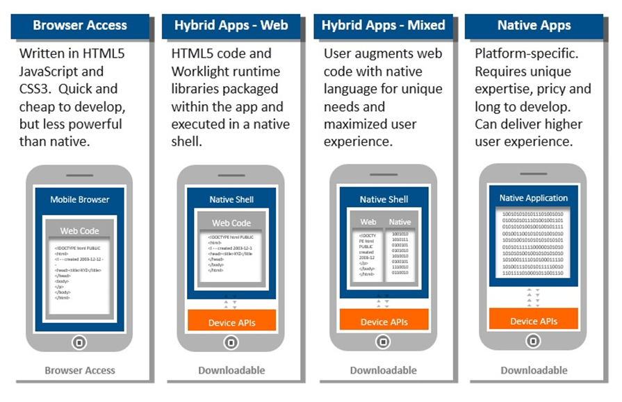

# Native, Hybrid, Web

Wir werden in den kommenden Tagen viel über die drei Hauptbegriffe Native, Hybrid, Web und deren Vor-/Nachteile sprechen. In diesem Kapitel lernst du die genannten drei Hauptbegriffe kennen und verschaffst dir einen Überblick in die mobile App Entwicklung.

### Native

Bei einer nativen Applikation wird meist gemeint, dass die App explizit für ein Betriebssystem \(iOS, Android, ...\) programmiert wurden. So kann z.B. eine mit der Programmiersprache Swift \(Apple\) für iOS geschriebene App nicht auf Android laufen.

### Web

Hier spricht man grundsätzlich von einer Web-Applikation. Also einer responsiven Webseite welche im Browser des Mobiltelefons läuft und den Inhalt darstellt. Was heisst Responsive nochmal? Die Web-Applikation ist so optimiert, dass sie sich den verschiedenen Display-Grössen dynamisch anpasst. Web-Apps sind somit nicht geräteabhängig.

### Hybrid

Hybrid ist eine Mischform. Es werden sowohl Native-, wie auch Web-Komponenten zusammengeführt. Eine App kann so dank einem Framework auf die darunterliegende Hardware \(z.B. Adressbuch\) zugreifen und der Code ist zugleich auf mehreren Betriebssystemen wiederverwendbar.

## Übersicht der Eigenschaften

Anbei eine Gegenüberstellung der wichtigsten Eigenschaften:

|  | Web App | Hybrid App | Native App |
| :--- | :--- | :--- | :--- |
| Installation | Zugang mit Web Browser und URL | Download via App-Stores | Download via App-Stores |
| Verbindung und Offline Zugriff | Zugriff nur bei Internetverbindung, einzelne Ansichten können aus dem Cache geladen werden. | Anwendung kann starten, braucht jedoch Internetverbindung um Daten abzurufen | Läuft offline, sobald Daten zu einem Server gesendet oder abgerufen werden müssen, benötigt es ebenfalls eine Internetverbindung |
| Aktualisierungen | Die App wird zentral aktualisiert und alle Geräte haben sofort die neuste Version | Neue Versionen der App müssen jedesmal neu installiert werden. Ist ein Update nur auf ein HTML Element relevant, kann dies zentral aktualisiert werden | App muss immer über den App Store aktualisiert werden. Dies geschieht oft automatisch im Hintergrund. |
| Geschwindigkeit | Performance Probleme, bei langsamer Internet Verbindung. Ansonsten ist bei modernen Smartphones kaum eine Verzögerung spürbar. | Schneller als eine Web Anwendung, da mehr zwischengespeichert wird. Ansonsten ist bei modernen Smartphones kaum eine Verzögerung spürbar. | Schnell |
| Grafik | HTML5, CSS3 PNGs SVGs Sehr scharf auch auf Retina-Displays | HTML5, CSS3 PNGs SVGs Sehr scharf auch auf Retina-Displays | Native API Sehr scharf auch auf Retina-Displays |
| Design | Bei mobilen Browsern ist oft die Adressleiste etwas störend und kann nicht immer ausgeblendet werden. Ansonsten kann eine ähnliche Optik und Haptik wie mit einer nativen App erstellt werden. | Ähnliche Optik und Haptik wie mit einer nativen App kann erstellt werden. | Am meisten Design Optionen. |
| Zugriff |  |  |  |
| Kamera | Ja | Ja | Ja |
| GPS Standort | Ja | Ja | Ja |
| Benachrichtigungen \(Notifications\) | Ja | Ja | Ja |
| Kontakte und Kalender | Nein | Ja | Ja |
| Gesten | Ja | Ja | Ja |
| Lokaler Speicher | HTML5 Cache, SQLite | Lokaler Datenspeicher, HTML5 Cache, SQLite | Lokaler Datenspeicher |
| Verlinkung von Apps \(Deep Linking\) | Ja | Ja | Ja |
| Suche | Ja, Indexierung läuft auf Webserver. | Ja, Indexierung läuft auf Webserver. | Über Datenbank, wenn indexiert, oder via Suche über Webserver, falls angebunden. |
| Monetarisierung der App | Gleich wie auf Internetseiten. Pay-Per-Use, Abonnement, Werbung, Zugang nur gegen Bezahlung, usw. | Beim Kauf der App sowie In-App Käufe möglich | Beim Kauf der App sowie In-App Käufe möglich |

Die neuesten Daten sind auch hier ersichtlich:



## Welche Art von Apps schreiben wir in diesem Kurs?

Wir fokussieren uns in diesem Kurs auf Hybride Apps. Folgende Gründe sprechen dafür:

* Ihr könnt die Apps auf allen Geräten testen
* Ihr habt bereits Erfahrungen mit HTML, CSS & JS
* Wir wollen Apps schreiben und uns nicht mit einer Programmiersprache abmühen

## Gruppenübung

Wir werden nun das gewonnene Wissen in einer kleinen Google Slides Herausforderung ergänzen:

1. Begib dich in eine der Drei vom Kursleiter erstellten Gruppen
2. Geh via [Moodle](https://kurse.ict-bz.ch/) -&gt; Nützliche Links auf den entsprechenden Ordner _"Tag1/Teil3\_NativeHybridWeb"_ und öffne die Datei online.
3. Beantworte dort die Fragen zu dem dir zugeteilten Thema
4. Ergänze deine Slides mit Bildern

Wir besprechen deine Ergebnisse gemeinsam.

## Wie sieht die Zukunft aus?

Die Zukunft werden sogenannte Progressive Web Apps \(kurz. PWA\) sein, hier ein Überblick:



