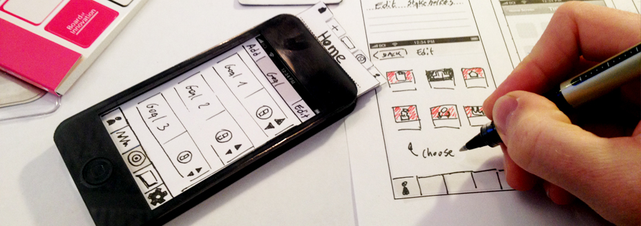
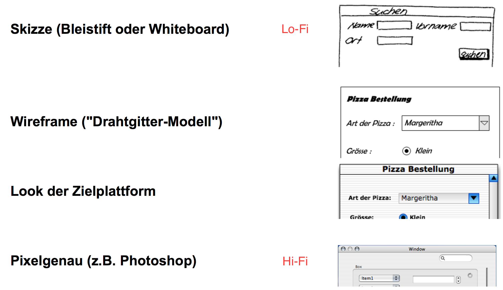
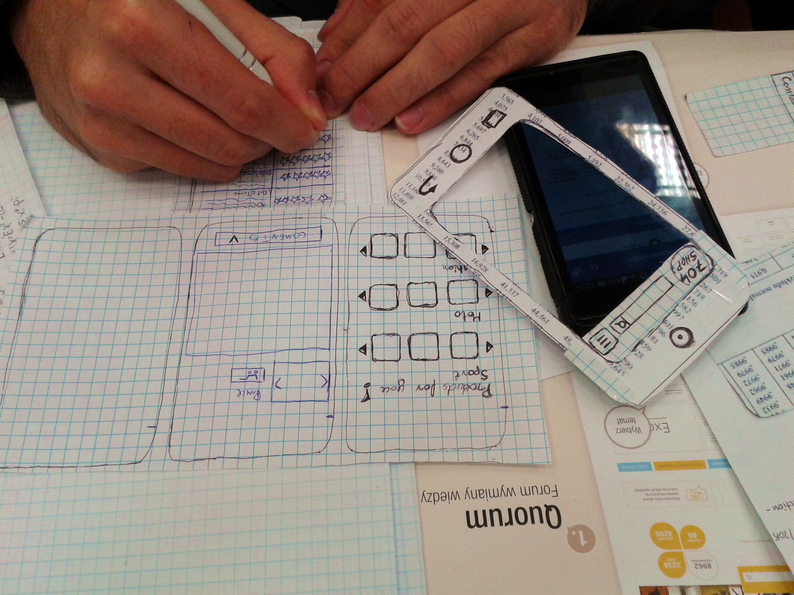

# Prototyping

## Definition Protoyping

> Prototyping ist eine Methode, die schnell zu ersten Ergebnissen führt und frühzeitiges Feedback bezüglich der Eignung eines Lösungsansatzes ermöglicht.
>
> Durch Prototyping entsteht eine zum Teil funktionsfähige Vorabversion einer Benutzeroberfläche. Mit ihr kann früh getestet werden, ob die Anwendung die Anforderungen erfüllt.

### Einsatzgebiet von Prototypen

* Diskutieren von Design-Lösungen im Projekt
* Testen von Design-Lösungen mit Benutzern 
* Vergleich von verschiedenen Varianten
* Präsentation für Überzeugungsarbeit
* Prototyp als Basis für Styleguide
* Prototyp als Spezifikation

### Vorteile von Prototypen

* Ermöglicht produktspezifisches Testing von Fragen, die nicht durch allgemeine Forschungsergebnisse oder Richtlinien beantwortet werden können
* Liefert relativ schnell bedeutungsvolle Rückmeldungen vom Benutzer
* Reduziert die totalen Entwicklungskosten für ein Produkt
* Kann früh im Entwicklungsprozess eingesetzt werden

### Nachteile des Prototyping

* Begrenzungen und Randbedingungen, auf die das reale Produkt trifft, werden oft während des Prototyping zu stark vernachlässigt
* Erzeugung unrealistischer Erwartungen für die Fähigkeiten des Endproduktes
* Gefahr der Überfrachtung des Prototyps
* Der Prototypingprozess kann schwierig zu managen und zu

  kontrollieren sein

* Prototyp ist nur eine begrenzte Simulation des schlussendlichen Produktes \(flach/tief\)

## Arten von Prototypen

Bei Prototypen wird oft von der "fidelity" \(deutsch: Wiedergabetreue\) gesprochen. Dabei unterscheidet man zwischen einem Lo-Fi resp. Hi-Fi Prototypen. Lo-Fi ist eher eine Skizze, wobei Hi-Fi ein sehr durchgedachter, designter Prototyp ist.

### Pen & Paper

Ein Stift und Papier findest du noch in jedem Büro. Viele UX-Designer haben oft einen kleinen Block und einen Stift \(z.B. Moleskine\) dabei. Deine geniale App-Idee kannst du auch unterwegs mit einem Pen & Paper Prototyp festhalten, die Website [UIStencils](http://www.uistencils.com/) bietet dir eine Vielzahl von möglichen Tool fürs Prototyping.  

Mögliche Vorlagen gibt es z.B. hier:

[https://www.sketchappsources.com/category/mobile.html](https://www.sketchappsources.com/category/mobile.html)

### Wireframing

Anders als ein „Mock-up“ ‒ ein visueller Prototyp ‒ wird der Begriff Wireframe \(Drahtmodell\) dazu benutzt, einen sehr frühen konzeptionellen Entwurf einer Website oder eines Software-Frontends darzustellen. Dabei spielt die Gestaltung und Funktion noch keine Rolle. Das Augenmerk liegt auf der Anordnung von Elementen und der Benutzerführung \(UX, Benutzererfahrung\).

Es gibt zwei Arten eines Wireframes:

* Zum einen statische Wireframes:

  Dies ist eine schematische Darstellung einer einzelnen Seitenvorlage. Hier werden die grundlegenden Elemente der Seite festgehalten. Ein konzeptionelles Layout sollte erkennbar sein. Ein vollendetes Design ist nicht notwendig.

* Des Weiteren gibt es auch dynamische Wireframes.

  Diese bestehen aus mehreren Seiten, die als funktioneller Prototyp interaktiv miteinander verknüpft sind. So ist eine Navigation von einer zur anderen Seite möglich. Dynamische Wireframes werden häufig durch einen beiliegenden Navigationsbaum oder ein Flussdiagramm ergänzt, welche beide die Struktur abstrahieren und leichter verständlich machen.

## Gruppenübung

Wir werden nun das gewonnene Wissen in einer kleinen Google Slides Herausforderung ergänzen:

1. Begib dich in eine der Drei vom Kursleiter erstellten Gruppen
2. Geh via [Moodle](https://kurse.ict-bz.ch/) -&gt; Nützliche Links auf den entsprechenden Ordner _"Tag1/Teil10\_PrototypingTools"_ und öffne die Datei online.
3. Beantworte dort die Fragen zu dem dir zugeteilten Thema
4. Ergänze deine Slides wie in der Vorlage ersichtlich.

Wir besprechen deine Ergebnisse gemeinsam.

## Übung

Schnapp dir einen Stift, Papier \(evt. eine Vorlage\) und beginne mit der folgenden Übung. Ralph ist dein Auftraggeber und hatte eine coole Idee für ein App, er hat sie dir hier textuell beschrieben. Erstelle einen Lo-Fi Prototypen und halte dich an die gängigen UI-Standards. Versuch auch dein Wissen aus den "Laws of Gestalt" anzuwenden.

#### Ausgangslage:

Ralph schmeisst in seiner WG ab und zu mal eine coole Party. Bis jetzt wusste er aber nie so richtig, wie viele Leute an die Party kommen resp. wie sie die Party fanden. Meistens wurde er auch nach dem Event mit unzähligen Fotos im WhatsApp bombardiert, welche er nur mühsam mit allen Gästen teilen konnte.

#### Details:

1. Die App wird durch ein Login geschützt 1. Für ein Login braucht es ein Benutzername / Passwort und ein Login-Button
   1. Wenn jemand noch keinen Account hat, soll er sich Registrieren können. Dazu braucht er mind. Benutzername, Email, Passwort.
2. Die App soll aus drei Tabs bestehen:
   1. Anmeldung
   2. Fotos
   3. Einstellungen
3. Im Tab Anmeldung soll eine Liste von Events erscheinen
   1. Ein Event hat jeweils ein Titel, ein kleines Foto und ein Datum welches in der Liste angezeigt wird
   2. Klickt ein Benutzer auf den Event kommt er zur Detailseite, dort sieht er zusätzlich noch einen Beschreibungstext zum Event.
   3. Will er sich für den Event Anmelden, kann er dies dort mittels Button tun
4. Der Tab Fotos ist eine Sammlung von mehreren Fotos und jeweils pro Event gruppiert.
   1. Die Gruppierung muss optisch ersichtlich sein
   2. Ein Benutzer muss ein Foto zu einem Event hochladen können
   3. Klickt er in der Übersicht auf ein Foto geht dies in voller Grösse auf
   4. Er kann ein Foto Liken oder auch Teilen \(z.B. via Facebook, WhatsApp\)
5. Im Tab Einstellungen kann folgendes gemacht werden
   1. Es werden Informationen zu Copyright & Author angezeigt
   2. Es gibt ein Logout-Button
   3. Es gibt eine Email-Adresse, klickt man darauf wird der Benutzer gefragt, ob die Mail-App geöffnet werden soll

**Zusatzaufgaben**

1. Überleg dir was du alles umbauen musst um die App in einem Sidemenu darzustellen, zeichne einige Mocks dazu
2. Probier die App mit einem Online Prototyping Tool nachzuzeichnen und gehe dabei von einem Lo-Fi zu einem klickbaren Prototypen über

