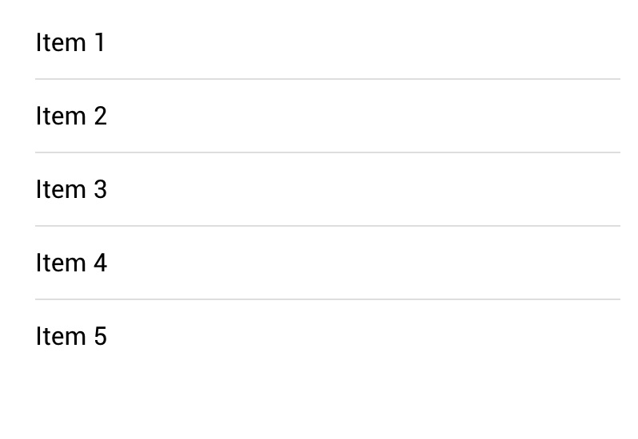

# Angular: Directives

Direktiven \(Directives\) sind ein wichtiges Konzept in einer Angular Applikation. Siehe dazu auch folgendes Kapitel in der [Doku](https://angular.io/guide/structural-directives). Mit Direktiven werden die Komponenten in einer App dynamisch, an Daten gebunden, es lässt Elemente wiederholen und vieles mehr.

Angular Direktiven sind erweitertes HTML mit dem Prefix `ng`.

Kurz gesagt: Mit Direktiven wird deine App zu einer voll funktionsfähigen App.

Eine Direktive erlaubt es uns nun, ein Stück HTML Code um zusätzliche Informationen / Funktionalität zu erweitern. Wenn man z.B. ein Listen-Eintrag hat:

```markup
<ion-item>List Item</ion-item>
```

Wird dieser um einiges mächtiger wenn wir ihn so schreiben:

```markup
<ion-item *ngFor="let item of items">{{item.name}}</ion-item>.
```

Ein einfaches `*ngFor` hat es uns nun erlaubt über die komplette Liste von Elementen zu iterieren.

## Die wichtigsten Direktiven

### ngFor

Ist wohl eine der meist verwendeten Direktiven im Zusammenhang mit Listen und Objekten. Es lässt sich sehr einfach über alle Elemente in einer Liste iterieren:

```javascript
// ngForExample.ts
...
items: any = [{id: 1}, {id: 2}, {id: 3}, {id: 4}, {id: 5}];
...
```

```markup
<!-- ngForExample.ts -->
<ion-content padding>
    <ion-list>
        <ion-item *ngFor="let item of items">Item {{item.id}}</ion-item>
    </ion-list>
</ion-content>
```

Nachdem wir im Component einige Daten gesetzt haben, können wir mit `*ngFor` durch die Liste gehen. Dies erlaubt uns nachher `{{item.id}}` in einem List-Item zu verwenden und den Inhalt so dynamisch auszugeben:



Das Resultat ist, dass das Listen-Element 5 mal dupliziert wird und die ID zusammen mit dem Tag "Item" ausgegeben wird.

#### Sortierung

Oftmals möchte man die Elemente auch sortiert ausgeben. In diesem Fall kann man direkt in `ngFor` ein Filter setzen. Möchte man z.B. hier eine umgekehrte Ausgabe wäre dies mit Pipes zu lösen, dazu später mehr.

### \(input\) - Event

Es kann vorkommen, dass man eine Funktion aufrufen möchte wenn das `ngModel` für dein Textfeld ändert. Obwohl man es auch mit `[(ngModel)]` einem Two-Way-Binding machen könnte, bevorzugen wir hier die einfachere Variante.

Gehen wir nochmals zum Beispiel mit dem Namen-Textfeld, welches wir in Data Binding angeschaut haben. Wir können dort ein Javascript-Alert hinzufügen sofern der Name geändert wird. Klar ist ein Alert eine suboptimale Idee - erfüllt aber in diesem Beispiel den Zweck.

```javascript
// keyupExample.ts
...
  data: any = {'name': 'Ralph'}

  nameChanged(){
    alert("Mein Name wurde geändert auf: " + this.data.name);
  }
...
```

```markup
<!-- keyupExample.html -->
<ion-item>
  <ion-label fixed>Name</ion-label>
  <ion-input type="text" [value]="data.name" (input)="nameChanged()"></ion-input>
</ion-item>
```

Achtung: hier wird `(input)` als Event verwendet. Das heisst nach jedem Tastaturanschlag wir ein `alert()` ausgelöst, natürlich unschön. Eine saubere Lösung würde man mit Observables implementieren, sprengt aber den aktuellen Rahmen hier.

### \(click\) - Event

`(click)` wird natürlich oft im Zusammenhang mit Links resp. Buttons verwendet.

Lass uns eine einfache Funktion hinzufügen, welche eine Javascript-Alert aufruft:

```javascript
// clickExample.ts
...
buttonClicked(){
    alert("Yeah, ich wurde angeklickt!"); 
}
...
```

```markup
<!-- clickExample.html -->
<ion-button color="secondary" (click)="buttonClicked()">Klick mich!</ion-button>
```

Nun setzen wir `(click)="buttonClick()"` wiederum auf eine Button-Komponente. Wichtig: Hier darf die Klammer `()` für den Funktionsaufruf nicht fehlen.

Weitere Events findest du z.B. hier: [https://developer.mozilla.org/en-US/docs/Web/Events](https://developer.mozilla.org/en-US/docs/Web/Events)

## \[hidden\] / ngIf

Machmal möchte man eine Komponente anzeigen resp. verschwinden lassen je nachdem ob der Wert in einer Variable true oder false ist \(oder auch wenn ein JavaScript-Ausdruck true/false ergibt\). Um dies mit Angular zu machen, brauchst du entweder `*ngIf` oder `[hidden]` Direktiven.

Diese Direktiven funktionieren in sich ähnlich. Als Beispiel ist der Wert `true` in `*ngIf` wird die Komponente anzeigen, aber ein Wert `true` mit `[hidden]` wird Sie verstecken.

Lass uns ein einfaches Beispiel mit folgenden Code machen:

```javascript
...
showPicture: boolean = true;
...
```

Wir bauen nun ein Toggle mit `ngModel` so dass wir die Variable geändert wird wenn wir unsere App anschauen. Danach fügen wir bei unserem Bild die Komponente auf `ngIf` mit Wert `showPicture` hinzu.

```markup
  <ion-item>
    <ion-label>Bild anzeigen</ion-label>
    <ion-toggle [(ngModel)]="showPicture"></ion-toggle>
  </ion-item>

  <ion-img *ngIf="showPicture" src="https://jaxenter.de/wp-content/uploads/2015/05/Ionic-Logo.jpg"></ion-img>
```

Nachdem wir den toggle gebraucht haben sehen wir das Bild erscheinen oder verschwinden. 

Danach fügen wir bei unserem Bild die Komponente auf `ngIf` mit Wert `showPicture` hinzu.

## Übung


1. Nimm dein am Tag 1 erstelltes  Projekt "GX\_NachnameVorname\_Übung" und erstelle darin eine neue Seite Namens "Rechner" 
2. Dein Auftrag wird es nun sein mit dem zuvor beschrieben Möglichkeiten eine Rechner-App für Ralph zu erstellen.
3. Mach vorher kurz eine Skizze \(Lo-Fi\) deiner Idee
4. Der Rechner soll folgenden Funktionsumfang haben:
   1. Nur ein Input-Feld \(Für Eingabe und auch Ausgabe des Resultats\)
   2. Dein Rechner soll die folgenden Grundfunktionen anbieten \(Buttons verwenden\)
      1. Addition \(+\) 
      2. Subtraktion \(-\)
      3. Multiplikation \(x\)
      4. Division \(÷\)
   3. Ein Button zum zurücksetzen
5. Teste dein App mittels Dev-App auf deinem Smartphone. Zufrieden?

Wir schauen uns einigen Lösungen gemeinsamen an.

#### Zusatzaufgabe:

1. Nimm dein Prototyp aus der Ionic: UI Übungen von heute Morgen. Vervollständige alle Listen mit `ngFor` und setze dazu ein paar fiktive Daten in deinem Code ein.  

