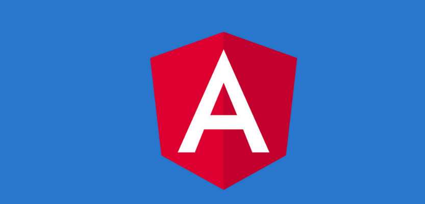
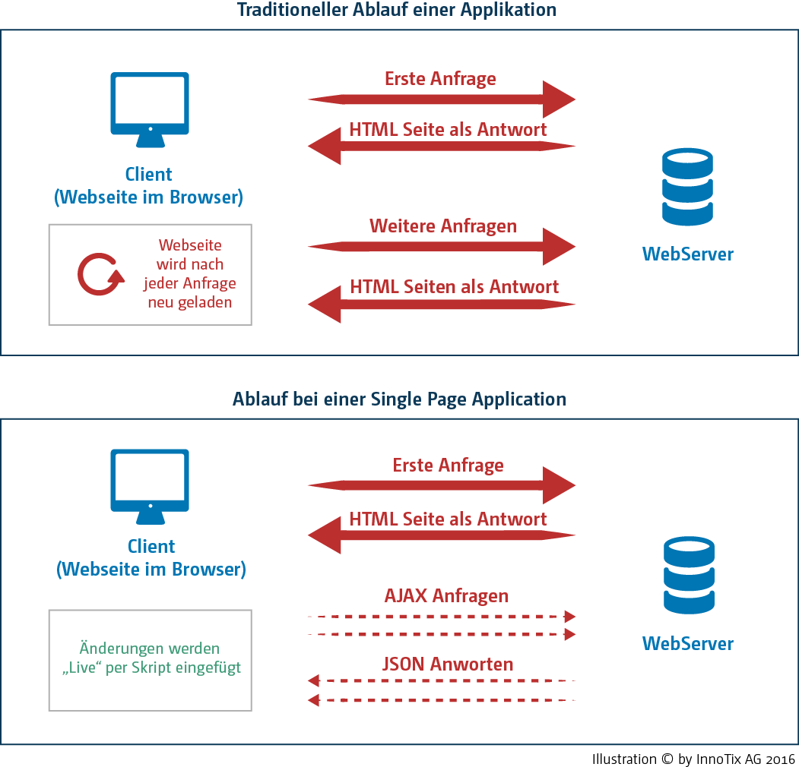
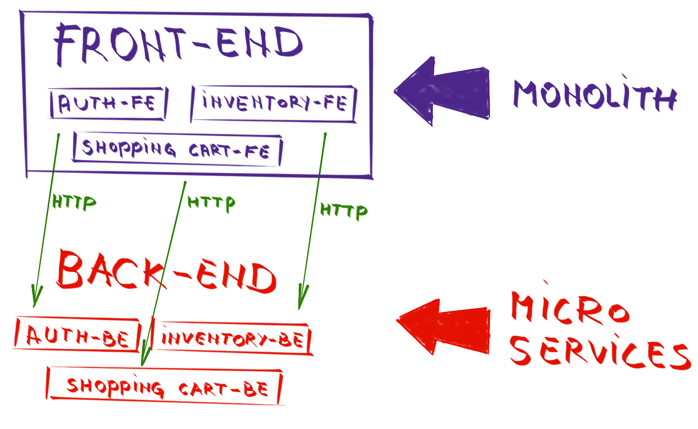
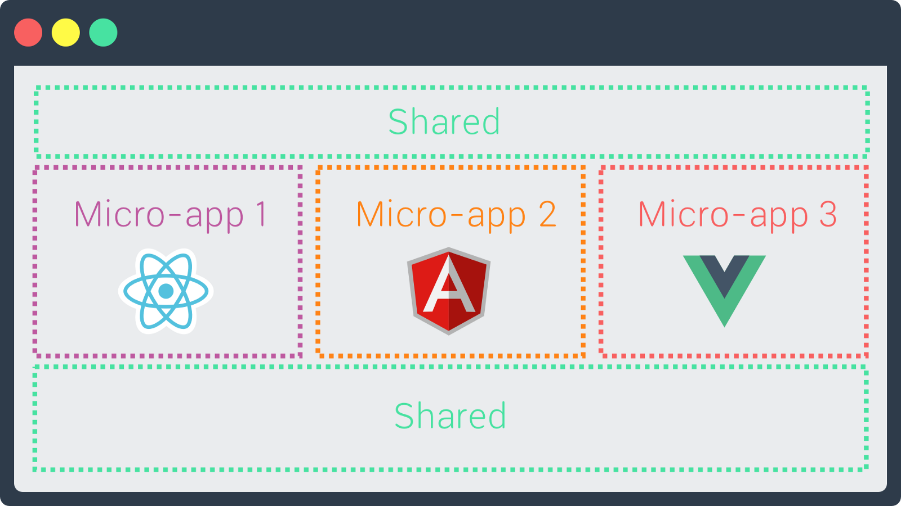

# Angular: Intro

## Was ist Angular?



[Angular](https://angular.io/) ist ein Open-Source-Framework welches von Google gesponsert und verwendet wird.

In Angular werden mit HTML-Code deklarativ die Oberflächen gestaltet. Ein wichtiger Aspekt ist, dass Anwendungslogik nur in den JavaScript-Dateien definiert wird. Dieser sollte weitmöglichst unabhängig von der Oberfläche sein. Im Gegensatz zu manch anderen MVC-Frameworks erweitert Angular den HTML-Code aber nur, anstatt ihn zu abstrahieren.  
Schon an diesem simplen Beispiel zeigt sich die Leichtigkeit von Angular. Der HTML Code ist einfach zu verstehen, enthält jedoch keine Logik. Durch das von Angular kontrollierte Binding ändert sich die Anzeige in Zeile 6, sobald in Zeile 5 ein Wert geändert wird. Der vergleichbare jQuery Code wäre deutlich länger!

```markup
<ion-content>
  <span>Anzahl Elemente: {{list.length}} </span>
  <ul>
    <li *ngFor="let element of list">
      <input type="text" [(ngModel)]="element.text">
      <span>{{element.text}}</span>
    </li>
  </ul>
</ion-content>
```

Und hier noch der dazugehörige Controller:

```javascript
export class ElementComponent {
    list: any[] = [
    {text:'angluarjs'},
    {text:'jQuery'}];

}
```

## Ablauf einer Anfrage



### Vorteil einer Single Page Applikation

* Gesamte Applikations-Logik im Browser
* Hohe Geschwindigkeit durch Wegfall langer Ladezyklen
* App-Feeling durch schnelle dynamische Inhaltsanpassungen
* Tiefes zu übertragendes Datenvolumen, mit einhergehendem Performance-Vorteil bei Mobile-Webapplikationen.

### Wohin geht die Zukunft?

Sicherlich ist ein weiterer Trend die Aufteilung einer Single Page Application in einzelne sogenannte [Web-Compontents](http://webcomponents.org/) und die Unterteilung der Architektur in Micro-Services.





## Kurze Geschichte von Angular

AngularJS  v1.x wurde nicht für den mobilen Einsatz gebaut, Angular \(&gt; v2\) hingegen schon. Angular ist durch eine hierarchische Dependency Injection um einiges schneller als AngularJS und ein grosses Update.  
Hier weitere wichtige Vorteile von Version &gt; 2.0:

| Vorteile Angular |
| :--- |
| Komponenten basierte Programmierung |
| Ist ein Framework |
| Verwendet TypeScript |
| Verwendet component und directives |
| Etwas kompliziertes mit Aufwand verbundenes Setup, da Abhängigkeiten zu Bibliotheken bestehen |
| Verwendet camelCase, z.B. ngModel |

### Codebeispiel Angular

```javascript
import { Component } from '@angular/core';

@Component({
    selector: 'prodsdata',
    template: '<h3>{{prods.name}}</h3>'
})

export class ProductComponent {
    prods = {name: 'Prod1', quantity: 1 };
}
```

## Gruppenübung


Lass uns in ein paar Google Slides einige Angular Applikationen zusammentragen:

1. Geh via [Moodle](https://kurse.ict-bz.ch/) -&gt; Nützliche Links auf den entsprechenden Ordner _"Tag2/Teil22\_AngularApps"_ und öffne die Datei online.
2. Erstelle dort einen oder mehrere neue Slides und suche im Internet nach Applikation \(auch Beispiel Apps\) welche mit Angular erstellt werden. \(Alternativ auch mit AngularJS \) 
3. Ergänze deine Slides mit Bildern oder Code-Beispielen.

Wir besprechen die Ergebnisse in Rund 15min gemeinsam gemeinsam.

