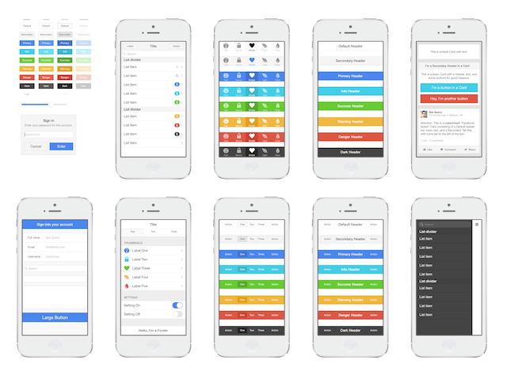

# Ionic: UI

  
Ionic bietet eine sehr gute Dokumentation zu allen UI-Elementen an. Um unnötige Duplikationen zu vermeiden verweisen ich hier auf folgende Links:

[Dokumentation ab Ionic 2.x](http://ionicframework.com/docs/v2/components/)

Natürlich können die Elemente auch umgestylt werden. Dazu sehen wir aber später mehr...

## Ionicons

**Tipp von Ralph:**

> Wilst du Icons in deiner App verwenden? Bilder abspeichern ist dir zu mühsam resp. eine externe Bibliothek wie [FontAwesome](http://fontawesome.io/) ist dir zu mächtig?
>
> Ionic hat ihre eigene Icon-Sammlung zusammengestellt, sie nennen Sie [Ionicons](https://ionicframework.com/docs/ionicons/) und ich kann Sie dir empfehlen!

## Übung

Hey, du hast am Tag 1 für meine WG-Partys auf Papier einen Prototypen gezeichnet - hoffe es hat dir Spass gemacht. Ich denke es ist nun an der Zeit das du dich mit der IDE vertraut machst:

1. Erstelle ein neues Projekt in der Ionic CLI. Wähle dabei doch ein Tabs-Projekt und nenne es z.B. _Uebung\_UI\_WGParty_
2. Versuche die einzelnen Screens, inkl. UI-Elemente nachzubilden, die UI Elemente findest du in der Ionic Doku. Kümmere dich vorerst mal ums HTML und erst in einem zweiten Schritt ums Styling \(SCSS\)
3. Zusatz: Wenn du schon sehr weit bist, suche doch in den Ionic Docs nach der Navigation. Wir schauen uns später heute noch an wie das geht. 

