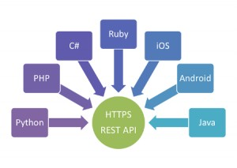

# REST, CRUD

## REST - Representational State Transfer

Representational State Transfer \(abgekürzt REST, seltener auch ReST\) bezeichnet ein Programmierparadigma für verteilte Systeme, insbesondere für Webservices. REST ist eine Abstraktion der Struktur und des Verhaltens des World Wide Web. REST hat das Ziel, einen Architekturstil zu schaffen, der die Anforderungen des modernen Web besser darstellt. Dabei unterscheidet sich REST vor allem in der Forderung nach einer einheitlichen Schnittstelle \(siehe Abschnitt Prinzipien\) von anderen Architekturstilen.

### 6 Eigenschaften der Architektur:

#### Client-Server

Es gilt generell die Anforderung, dass alle Eigenschaften der Client-Server-Architektur gelten. Dabei stellt der Server einen Dienst bereit, der bei Bedarf vom Client angefragt werden kann.

#### Zustandslosigkeit

Jede REST-Nachricht enthält alle Informationen, die für den Server bzw. Client notwendig sind, um die Nachricht zu verstehen. Weder der Server noch die Anwendung soll Zustandsinformationen zwischen zwei Nachrichten speichern. Man spricht daher von einem zustandslosen Protokoll. Jede Anfrage eines Clients an den Server ist insofern in sich geschlossen, als sie sämtliche Informationen über den Anwendungszustand beinhaltet, die vom Server für die Verarbeitung der Anfrage benötigt werden.

Zustandslosigkeit in der hier beschriebenen Form begünstigt die Skalierbarkeit eines Webservice. Beispielsweise können eingehende Anfragen im Zuge der Lastverteilung unkompliziert auf beliebige Maschinen verteilt werden: Da jede Anfrage in sich geschlossen ist und Anwendungsinformationen somit ausschließlich auf der Seite des Clients vorgehalten werden, ist auf der Seite des Servers keine Sitzungsverwaltung erforderlich. In der Praxis nutzen deswegen viele HTTP-basierte Anwendungen Cookies und andere Techniken, um Zustandsinformationen auf der Client-Seite zu behalten. Weiterhin begünstigt wird die Ausfallsicherheit, weil die Zustandslosigkeit fordert, dass transaktionale Datenübertragung in einem einzigen Seitenaufruf erfolgt.

#### Caching

HTTP Caching soll genutzt werden, wobei aber gilt: Eine Anfrage, die nicht gestellt werden muss, ist die schnellste Anfrage.

#### Einheitliche Schnittstelle

Dies ist das Hauptunterscheidungsmerkmal von allen weiteren Architekturstilen. Dabei besteht diese aus vier weiteren Eigenschaften. Ziel ist die Einheitlichkeit der Schnittstelle und somit ihre einfache Nutzung.

**Adressierbarkeit von Ressourcen**

Jede Information, die über einen URI kenntlich gemacht wurde, wird als Ressource gekennzeichnet. Jeder REST-konforme Dienst hat eine eindeutige Adresse, den Uniform Resource Locator . Diese „Strasse und Hausnummer im Netz“ standardisiert den Zugriffsweg zum Angebot eines Webservices für eine Vielzahl von Anwendungen \(Clients\). Eine konsistente Adressierbarkeit erleichtert es ausserdem, einen Webservice als Teil eines \[Mashups\]\([https://de.wikipedia.org/wiki/Mashup\_\(Internet\)](https://de.wikipedia.org/wiki/Mashup_%28Internet%29)\) weiterzuverwenden.

**Repräsentationen zur Veränderung von Ressourcen**

Die unter einer Adresse zugänglichen Dienste können unterschiedliche Darstellungsformen \(Repräsentationen\) haben. Ein REST-konformer Server kann je nachdem, was die Anwendung anfordert, verschiedene Repräsentationen einer Ressource ausliefern, z. B. in verschiedenen Sprachen oder Formaten \([HTML](https://de.wikipedia.org/wiki/Hypertext_Markup_Language), [JSON](https://de.wikipedia.org/wiki/JavaScript_Object_Notation) oder [XML](https://de.wikipedia.org/wiki/Extensible_Markup_Language)\) oder auch die Beschreibung oder Dokumentation des Dienstes. Die Veränderung einer Ressource \(also deren aktuellen Status\) soll nur über eine Repräsentation erfolgen.

**Selbstbeschreibende Nachrichten**

REST-Nachrichten sollen selbstbeschreibend sein. Dazu zählt u. a. die Verwendung von Standardmethoden. Über diese Standardmethoden lassen sich Ressourcen manipulieren. Als Beispiel seien an dieser Stelle die HTTP-Verben genannt;

#### Mehrschichtige Systeme

Die Systeme sollen mehrschichtig aufgebaut sein. Dadurch reicht es, dem Anwender lediglich eine Schnittstelle anzubieten. Dahinterliegende Ebenen können verborgen bleiben und somit die Architektur insgesamt vereinfacht werden.

### Umsetzung mit HTTP

Für die Umsetzung des REST-Paradigmas wird ein zustandsloses Client-Server-Protokoll verwendet. Als Anwendungsschicht-Protokolle werden hauptsächlich HTTP und HTTPS eingesetzt.

Wird über HTTP zugegriffen, so gibt die verwendete HTTP-Methode, darunter `GET`, `POST`, `PUT` und `DELETE`, an, welche Operation des Dienstes gewünscht ist. HTTP schreibt vor, dass `GET` „sicher“ sein muss, was bedeutet, dass diese Methode nur Informationen beschafft und keine sonstigen Effekte verursacht. Die Methoden `GET`, `HEAD`, `PUT` und `DELETE` müssen laut HTTP-Spezifikation idempotent sein, was in diesem Zusammenhang bedeutet, dass das mehrfache Absenden der gleichen Anforderung sich nicht anders auswirkt als ein einzelner Aufruf.

REST-Clients, die HTTP verwenden, können folgende Befehle absetzen, um Ressourcen anzufordern oder zu verändern:

| HTTP-Methode | Beschreibung |
| :--- | :--- |
| GET | fordert die angegebene Ressource vom Server an. GET weist keine Nebeneffekte auf. Der Zustand am Server wird nicht verändert, weshalb GET als sicher bezeichnet wird. |
| POST | fügt eine neue \(Sub-\)Ressource unterhalb der angegebenen Ressource ein. Da die neue Ressource noch keinen URI besitzt, adressiert der URI die übergeordnete Ressource. Als Ergebnis wird der neue Ressourcenlink dem Client zurückgegeben. POST kann im weiteren Sinne auch dazu verwendet werden, Operationen abzubilden, die von keiner anderen Methode abgedeckt werden. |
| PUT | die angegebene Ressource wird angelegt. Wenn die Ressource bereits existiert, wird sie geändert. |
| DELETE | löscht die angegebene Ressource. |

Abhängig von der Implementierung können noch weitere HTTP-Befehle unterstützt werden. \(HEAD, PATCH, OPTIONS, CONNECT, TRACE, usw.\)

_Quelle :_ [Wikipedia - Representational State Transfer](https://de.wikipedia.org/wiki/Representational_State_Transfer#cite_ref-optional_8-0)

### Gruppenübung

Wir werden nun das gewonnene Wissen in einer kleinen Google Slides Herausforderung ergänzen:

1. Begib dich in eine der Drei vom Kursleiter erstellten Gruppen
2. Geh via [Moodle](https://kurse.ict-bz.ch/) -&gt; Nützliche Links auf den entsprechenden Ordner _"Tag3/Teil42\_REST"_ und öffne die Datei online.
3. Beantworte dort die Fragen zu dem dir zugeteilten Thema
4. Ergänze deine Slides wie in der Vorlage ersichtlich.

Wir besprechen deine Ergebnisse gemeinsam.

## CRUD

Das Akronym CRUD umfasst die grundlegenden Datenbankoperationen:

| CRUD-Operation | Beschreibung | SQL | HTTP \(REST\) |
| :--- | :--- | :--- | :--- |
| Create | Datensatz anlegen | `INSERT` | `POST` |
| Read | Datensatz lesen | `SELECT` | `GET` |
| Update | Datensatz aktualisieren | `UPDATE` | `PUT` |
| Delete | Datensatz löschen | `DELETE` | `DELETE` |

Vergleich herkömmliches Framework \(links\) versus CRUD-Framework \(rechts\) am Beispiel von:

Der Hauptvorteil eines CRUD-Frameworks ist der folgenden Grafik zu entnehmen. Eine Anfrage geht direkt von der Präsentationsschicht bis runter in die Datenbank. Es werden keine zusätzlichen Verzweigungen und Verschachtelungen gebaut.

_Quelle:_ [_Wikipedia - CRUD_ ](https://de.wikipedia.org/wiki/CRUD)

