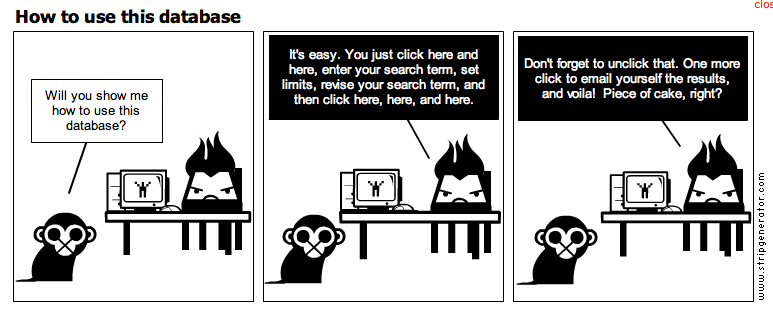

# Datenanbindung

Bei mobile Apps möchte man ziemlich schnell Daten speichern können. Sei es eine einfache Einstellung des Users, ganze Liste aus einer Datenbank laden und die App auch Offline benutzen. Es ist somit von sehr zentraler Bedeutung die folgenden Fragestellung bereits von Beginn deines Projekt zu stellen. Es kann auch gut sein, dass dein Anspruch an Persistenz sich mit zunehmenden Anforderungen ändert.

## Wichtige Fragestellungen

### Online/Offline

Wie muss die Verfügbarkeit meiner App sein? Soll der Benutzer die App hauptsächlich Offline \(z.B. also auch ohne Internet-Verbindung\) nutzen können oder sind die Daten so zentral gelagert, dass sie nur Online sein können.

### Schlechte Netzwerkverbindung

Was wenn die Internet-Verbindung sehr schlecht ist oder gar nicht funktioniert ? Ich spreche hier nicht vom ebenfalls sehr wichtigen Exception-Handling \(geht auch etwas ins Thema UX\), sondern von den Daten. Macht es Sinn, gewisse oder alle Daten Offline zu halten und mit der Online-Datenbank zu synchronisieren?

### Single vs. Multi-User

Sind die App-Daten nur für einen Benutzer gedacht oder sollen mehrere damit arbeiten? Will ich meinen Blog-Eintrag für nur eine Person bearbeitbar machen oder sollen mehrere Personen daran arbeiten können? Was passiert wenn 2 Benutzer gleichzeitig auf die Daten zugreifen möchten.

Es ist von zentraler Bedeutung, dass du als Entwickler dir solchen Fragen stellst und diese vor Go-Live deiner App annimmst.



## Gruppenübung


Wir werden nun das gewonnen Wissen in einer kleinen Google Slides Herausforderung ergänzen:

1. Begib dich in eine der Gruppen
2. Geh via [Moodle](https://kurse.ict-bz.ch) -&gt; Nützliche Links auf den entsprechenden Ordner _"Tag4/Teil49\_Datenanbindung"_

   und öffne die Datei online.

3. Beantworte dort die Fragen zu dem dir zugeteilten Thema
4. Ergänze die Slides wie in der Vorlage ersichtlich.

## Offline-Persistenz

Die Speicherung von Daten Offline hat Vor- / Nachteile. Anbei einige Argumente:

| Vorteile | Nachteile |
| :--- | :--- |
| lokale Daten | keine resp. nur schlechte Teilbarkeit |
| Keine Internet-Verbindung nötig | Limitierung bei Multi-User |
| Für kleine Daten optimal | Mühsame Verwaltung \(Release-Upgrades\) |

Es gibt online sehr viele Tutorials welche z.B. ein [Offline-Modus mit SQLite](http://blog.ionic.io/building-an-ionic-app-with-offline-support-part-1/) oder native Lösungen mit [Ionics Native Storage ](https://ionicframework.com/docs/v2/native/nativestorage/)resp. wiederum [SQLite](https://ionicframework.com/docs/v2/native/sqlite/) als Native Komponente beschreiben. Oft macht deren Einsatz Sinn, wenn man grosse Daten resp. Objekte \(z.B. in JSON\) speichern möchte.  
Für kleiner Daten funktioniert in Ionic resp. Cordova auch der [HTML 5 local Storage](http://www.w3schools.com/html/html5_webstorage.asp).

### HTML5 - lokaler Storage

Normalerweise kann man den HTML5 Local Storage in etwa so einsetzen:

```javascript
if(typeof(Storage) != "undefined") {
    localStorage.setItem("vorname", "Max");
    localStorage.setItem("nachname", "Muster");
    alert(localStorage.getItem("vorname") + " " + localStorage.getItem("nachname"));
} else {
    alert("Sorry, dein Browser unterstützt kein Web Storage...");
}
```

#### Ionic Storage

Ionic hat auch fürs persistieren von einfachen Daten eine Lösung bereit: [https://ionicframework.com/docs/building/storage](https://ionicframework.com/docs/building/storage)

Mit den Methoden `storage.set` `storage.get` kannst du einfache Key/Value-Paare oder JSON Objekte speichern:

```javascript
import { Storage } from '@ionic/storage';

export class MyApp {
  constructor(private storage: Storage) { }

  ...

  // set a key/value
  storage.set('name', 'Max');

  // Or to get a key/value pair
  storage.get('age').then((val) => {
    console.log('Your age is', val);
  });
}
```

## Übung - lokaler Storage


1. Lass uns nun einige Übungen mit dem Ionic Storage machen
2. Schnapp dir deine Übungsprojekt "GX\_NachnameVorname\_Übung" und erstelle darin eine neue Seite Namens "Lokaler Storage"
3. Sind dir die Ideen ausgegangen? Frag deinen Nachbar oder den Instruktor mit deinem Beispiel
4. Nun kannst du endlich deine Einstellungen realisieren, resp. dort auch was speichern
5. Zusatz: Erstelle eine Willkommens-Seite, die nur Einmalig beim App-Start angezeigt wird. Öffnet der Benutzer die App zum zweiten mal, soll die Seite nicht mehr angezeigt werden

## Online-Persistenz

Wir haben in der Gruppenübung zuvor einige Online-Tools kennengelernt. Bevor wir voll mit Firebase loslegen, hier noch die wichtigsten Vor-/Nachteile:

| Vorteile | Nachteile |
| :--- | :--- |
| Daten im Web | Internet-Verbindung nötig |
| Bestehende Online-Datenbank kann verwendet werden | Für kleine Daten nicht geeignet |
| Optimal für grosse Daten |  |
| Geeignet für grosse Datenmodelle |  |

Wir werden die kommenden Übungen mit [Google's Firebase](https://firebase.google.com/) als Backend as a Service absolvieren, schau dir dazu folgendes Video an:



### Eigenes Backend vs. Backend as a Service

_Quelle:_ [_http://www.app-entwicklung.info/2015/01/eigenes-backend-vs-backend-as-a-service/_](http://www.app-entwicklung.info/2015/01/eigenes-backend-vs-backend-as-a-service/) \_\_

Während man in der Vergangenheit das Backend einer Anwendung meist eigens implementiert und auf einen Dedizierten Server installiert hat, so geht der neueste Trend in Richtung „Backend as a Service“. Wo früher eigene Entwickler nötig waren, reichen nun wenige Klicks des Frontend-Entwicklers selbst, um einen fix fertigen Server zu haben, den man mittels bereitgestellter APIs oder einer automatisch generierten REST-Schnittstelle ansprechen kann. Solch ein „Backend as a Service“ erscheint im ersten Moment wie eine eierlegende Wollmilchsau, doch sind diese Backends wirklich so gut oder gibt es auch Nachteile bei diesen Services?

#### Man spart Zeit und Geld

Ein BaaS \(die Abkürzung steht für „Backend as a Service“\) bringt viele Möglichkeiten. Man kann mit wenigen Klicks die Tabellen am Server anlegen und bearbeiten, muss sich nicht um die Datenbank Anbindung kümmern und hat sofort eine funktionierende Schnittstelle für seine Frontend-Anwendung. Man benötigt keinen Entwickler mehr für das Backend, keine zeitaufwendige Kommunikation zwischen Frontend- und Backend-Entwickler, keine Dokumentation der Server-Schnittstelle und man hat auch keine Probleme mit der Benutzung der Schnittstelle. Das spart Zeit und Geld. Möchte man die Daten aufbereiten, so kann man auch eigene Zugangspunkte am Server definieren und mit wenig Programmcode die gewünschten Daten abrufen.

#### Spart man wirklich Geld?

Steigt die Last am Server, so skaliert dieser automatisch, man braucht sich um nichts kümmern, muss den Server nicht von Hand migrieren oder aufrüsten. Doch gerade hier verbergen sich die Kosten eines „Backend as a Service“. Während man die Services bei sehr kleinen Anwendungen sogar kostenlos nutzen kann, so steigen die Kosten mit der Anzahl der Anfragen pro Sekunde, mit jedem zusätzlich benötigten Gigabyte Festplatten- sowie Datenbankspeicher und mit jedem Gigabyte Datentransfer. Bei einem dedizierten Server wusste man genau, wieviel Speicher man hat und wieviel Datentransfer inkludiert ist \(oftmals unbegrenzt\), das Gesamtpaket hatte einen fixen Preis, die Kosten waren einfach kalkulierbar. Nutzt man beispielsweise den Service Parse, so ist es bis zu 30 Anfragen pro Sekunde, 20 GB Festplattenspeicher, 20 GB Datenbankspeicher und 2 TB Datentransfer kostenlos. Für jedes weitere Gigabyte Festplattenspeicher zahlt man 3 Cent, für weitere 20 Gigabyte Datenbankspeicher sogar $200, für jedes weitere Gigabyte Datentransfer 10 Cent und für jeweils 10 weitere Anfragen pro Sekunde stolze $100 pro Monat. Die eigentlichen Kosten kann man also sehr schwer berechnen, denn diese Werte hängen sehr stark von der Verbreitung und dem Inhalt der App, sowie vom Nutzerverhalten ab. Andere „Backend as a Service“ Anbieter haben wieder andere Arten der Abrechnung, ein Vergleich ist daher schwer möglich.

#### Sicherheit und Kontrolle

Eine weitere Schwachstelle von „Backend as a Service“-Diensten ist, dass man als Anwender keine Kontrolle darüber hat, wann und wie Datensicherungen durchgeführt werden. Alle Anbieter werben damit, dass die Daten in der „Cloud“ sicher gespeichert sind. Die tatsächliche Art der Datensicherung der einzelnen Anbieter findet man erst im Kleingedruckten. Parse speichert die Daten alle 30 Minuten und Konfigurationen alle drei Stunden. Bei Firebase findet man nur in einem Nebensatz der Dokumentation, dass Login-Daten einmal täglich gespeichert werden und Kinvey verschweigt auf der Webseite gänzlich, wann und wie die Daten gesichert werden. Auch eine Ausfallsicherheit ist oft nicht gegeben. Man hat im Grunde keinerlei Kontrolle über den Server, man weis nicht, was genau geschieht, wenn er ausfällt: Welche Daten werden gesichert? Wie schnell ist der Server wieder online? Man weiß auch nicht, wie sicher die Daten abgespeichert werden – vor allem wenn man mit sensiblen Nutzerdaten arbeitet, ist das ein kritischer Faktor.

#### Abhängigkeit vom Anbieter

Vor allem in Österreich ist auch der Standort der Server von entscheidender Rolle. Aus datenschutzrechtlichen Gründen ist beim Speichern von Benutzerdaten nämlich ein Server in der Europäischen Union empfehlenswert, doch das können einem die großen Anbieter wie Parse nicht garantieren. Die Daten liegen in der Cloud, der genaue Standort ist nicht definiert. Gründe wie dieser – und allein auch die aktuelle Beliebtheit von „Backend as a Service“-Providern – führen dazu, dass immer mehr kleine Anbieter auftauchen. Doch hier ist Vorsicht geboten, denn entscheidet man sich einmal für einen Anbieter, so ist man von diesem abhängig. Jeder Anbieter hat seine eigene Serverschnittstelle und native SDKs. Wird irgendwann ein Anbieterwechsel nötig, so reicht es nicht, die Server Adresse in der App zu ändern, beziehungsweise die Anfragen auf einen neuen Server umzuleiten, man kann keine Rückwärtskompatibilität gewährleisten. Und gerade durch die Übersättigung des Marktes mit „Backend as a Service“-Anbietern verschwinden einige davon recht schnell wieder von der Bildfläche – nicht nur kleine Anbieter, sondern auch große wie beispielsweise StackMob, die im Mai 2014 ihren „Backend as a Service“-Dienst stillgelegt haben, nachdem sie im Dezember 2013 von PayPal gekauft wurden.

#### Fazit

Man darf nicht vergessen, dass „Backend as a Service“-Dienste neben den Nachteilen auch viele Vorteile aufweisen. Parse bietet beispielsweise auch gleich Statistiken zur Nutzung der Anwendung, \(bis zu einer gewissen Anzahl\) kostenlose Push-Benachrichtigungen sowie Social-Logins \(Facebook, Twitter\). Man sollte bei jeder Anwendung abwägen, welcher Weg beschritten werden soll. Denn welche Funktionen benötigt werden und wie Komplex das Backend am Ende sein wird, hängt stark von der Art und Anforderung der Anwendung ab. Man kann nicht grundsätzlich sagen, ob ein „Backend as a Service“ oder ein eigenes Backend auf einem dedizierten Server die bessere Wahl ist, beides hat seine Vor- und Nachteile. Man sollte jedenfalls bedenken, dass ein „Backend as a Service“ kein vollständiger Serverersatz ist. Wenn eine Anwendung und damit die Anforderungen an den Server wachsen, kann solch ein Dienst schnell an seine Grenzen stoßen. Wenn gewisse Sicherheitsrichtlinien eingehalten werden müssen oder eine Anbindung an ein Fremdsystem notwendig ist, dann entwickelt sich ein „Backend as a Service“ schnell zum Wegwerf-Produkt. „Backend as a Service“ Systeme eignen sich gerade für Startups sehr gut um die Time-to-Market extrem zu verringern und mit minimalen Investitionskosten schnell etwas auf die Beine zu stellen. Wenn ein Geschäftsmodell einschlägt und man es professionell aufziehen möchte, dann wird man früher oder später einen eigenen Server mit dediziertem Backend aufstellen müssen.

