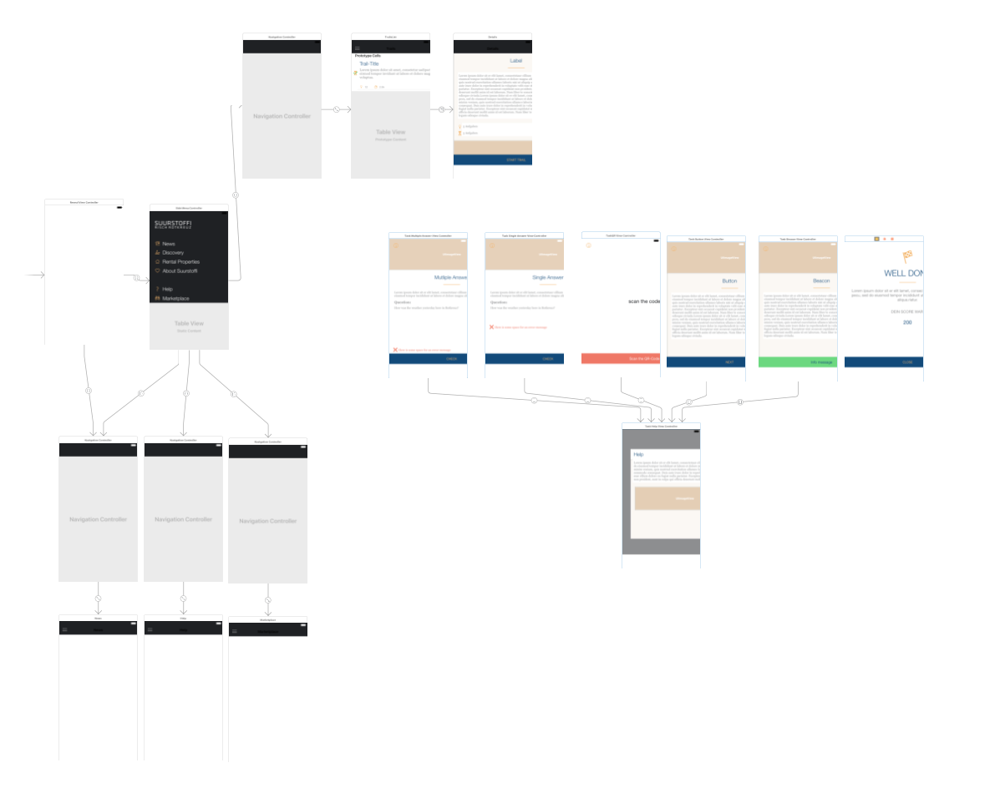
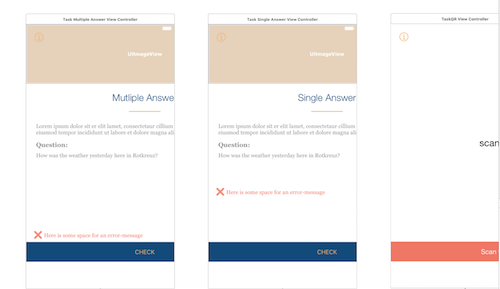

# iOS, Android Entwicklung

Wie du am Tag 1 gelernt hast, hat eine hybride Lösung Vor- und Nachteile. Die Native Entwicklung von iOS resp. Android App geschieht in den dafür vorgesehenen IDE's . Mit Xcode und Swift als Programmiersprache können Apps für iOS programmiert werden. Für Android verwendet man meistens Java \(oder Kotlin\) in Android Studio.

Wie ihr jetzt gesehen habt, hat Ionic Creator einige Vorteile. So konntet ihr relativ einfach eine Benutzerstory abbilden und die einzelnen Seiten verlinken. In Xcode ist das gleiche etwas mühsamer oder evt. einfach professioneller im sogenannten Storyboard auch möglich. Hier ein Beispiel: 

Dabei gibt es natürlich viel mehr Einstellungsmöglichkeiten, für ein professionelles Projekt sicher nützlich. Für Anfänger mit einer guten Idee eher hinderlich. 

Wir gehen hier nicht weiter auf die einzelnen Sprachen/IDE's ein. Schaut Euch folgende Youtube-Videos resp. die dazugehörigen Dokumentationen an:

## Xcode - Swift Anfänger Tutorial



[Dokumentation iOS Programmierung / Apple Developer Guide ](https://developer.apple.com/library/content/navigation/)

## Serie: Android Apps programmieren



[Dokumentation Android Programmierung / Google ](https://developer.android.com/guide/index.html)

