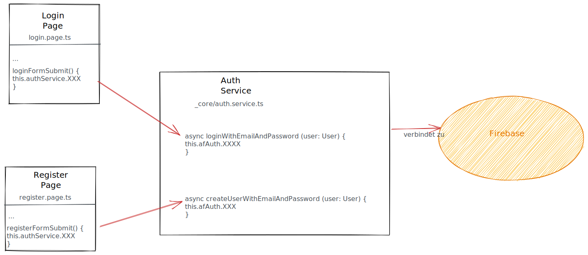

# Guards / Service / Login

Wenn wir das Angular Routing verwenden, können wir mit sogenannten _Guards_ Zugriff auf gewisse Routes (z.B.`/meineliste`) verhindern, sofern gewisse Konditionen zutreffen. \
Beispiele dafür sind:

* Willkommens und Tutorial-Seiten beim Start der App
* Login- und Registrierung-Formulare resp. die geschützten Seiten dazu

In den kommenden Kapiteln werden wir dies zusammen erarbeiten.

## Guards

Die grundsätzliche Idee ist es unseren Routes eine Route Guard anzuhängen. \
Diese Guard muss über eine `canActivate` resp. `canLoad` Methode verfügen, welche entweder `true` oder `false` zurück liefert. Wenn `true` zurückkommt wird dem Benutzer der Zugriff erlaubt, bei `false` wird er keinen Zugriff auf die Route erhalten.

`canActivate` wird verwendet um den Benutzer den Zugriff auf eine gewisse Route zu verweigern, `canLoad` hingegen verhindert sogar das Laden des Moduls und dessen Kinder anstatt nur den Zugriff. Dies sollte speziell im Fall von LazyLoaded Seiten verwendet werden. (siehe `loadChildren` in den `routes` der Datei `app-routing.module.ts`)


Wichtig: Wenn wir Auth Guards verwenden wird die Applikation nur Clientseitig im Browser geschützt. Er wird strengstens empfohlen die verwendeten Daten auf dem Server resp. den API-Endpunkt ebenfalls zusätzlich vor unerwünschten Zugriffen und Diebstahl zu schützen. Mehr dazu auch am Tag 5 im Kapitel Security.


In diesem Kapitel schauen wir uns zuerst das Login an, später am heutigen Tag kommt dann noch das Tutorial dazu.&#x20;


## Service

Um die Logik rund um das Login etwas zu entkoppeln und unser wachsendes Projekt sauber zu halten, erstellen wir einen Service. Verwende hier wiederum die Ionic CLI:

```
ionic generate service _services/Auth
```

Die soeben generierten Datei `auth.service.ts` im Ordner `_services` soll alles rund ums Login beinhalten. Hier ein mögliches Grundgerüst für einen `AuthService`, später sollen die mit `// TODO` markierten Stellen noch gefüllt werden.




```typescript
import { Injectable } from '@angular/core';
import { AngularFireAuth } from '@angular/fire/compat/auth';

@Injectable({
  providedIn: 'root'
})
export class AuthService {

  constructor(private afAuth: AngularFireAuth) { }

  async loginWithEmailAndPassword (user: User) {
    // TODO: Login für Benutzer ausprogrammieren
  }

  async createUserWithEmailAndPassword (user: User) {
   // TODO: Registrierung für den Benutzer ausprogrammieren
  }
  
  async logout() {
    // TODO: User ausloggen
  }
}
export interface User {
    email: string;
    password: string;
    displayname: string;
  }
```





```typescript
import { Injectable, OnDestroy } from '@angular/core';
import {
    Auth,
    authState,
    signInWithEmailAndPassword,
    signOut,
    User,
} from '@angular/fire/auth';
import { EMPTY, Observable } from 'rxjs';
import { map } from 'rxjs/operators';

@Injectable({
    providedIn: 'root',
})
export class AuthService implements OnDestroy {
    public readonly user: Observable<User | null> = EMPTY;

    constructor(private afAuth: Auth) {
        if (afAuth) {
            this.user = authState(this.afAuth);
        }
    }

    async loginWithEmailAndPassword(email: string, password: string) {
        // TODO: Login für Benutzer ausprogrammieren
    }

    async createUserWithEmailAndPassword(email: string, password: string) {
        // TODO: Registrierung für den Benutzer ausprogrammieren
    }

    async logout() {
         // TODO: User ausloggen
    }
}

```




###

### Mit `AngularFireAuthGuard` unsere Routes schützen

Seit Herbst 2019 bietet `@angular/fire` die `AngularFireAuthGuard` an, die uns die Komplexität rund um den Authentisierungsstatus mit Oberservables abnimmt, so dass wir fürs Login nicht noch eine eigene Guard schreiben müssen. &#x20;

* **Compatibility**: Für die `compat` Variante mit [AngularFireAuthGuards](https://github.com/angular/angularfire/blob/master/docs/auth/router-guards.md) muss  folgender Import im `app.module.ts` gemacht werden, damit man `AngularFireAuthGuardModule` weiter unten in die `imports` hinzugefügt kann
* **Modular:** Hier braucht es kein Import im `app.module.ts` mehr



```typescript
import { AngularFireAuthGuardModule } from '@angular/fire/compat/auth-guard';
```



```typescript
// Kein Import im app.module.ts nötig
```



Gut nun sind wir Startklar, was uns jetzt noch fehlt ist, dass wir die gewünschten Routes in unserem `app-routing.module.ts` mit einer `AngularFireAuthGuard` schützen. \
\
Dabei gehen wir wie folgt vor:



1. Einmalig: Neue Imports hinzufügen (Zeile 5)
2. Einmalig: Zwei neue Variable definieren um das Standardverhalten festzulegen (Zeile 8+9)
   1. `redirectUnauthorizedToLogin` = Wohin wird der User geleitet wenn er nicht eingeloggt ist
   2. `redirectLoggedInToRoot` = Wohin wird der User geleitet wenn er eingeloggt ist
3. Pro Route: Den zu schützenden Routes zwei weiteres Properties `canActivate` und `data` hinzufügen ( Zeile 21 + 22, Zeile 27+28, usw.)


```typescript
import { NgModule } from '@angular/core';
import { Routes, RouterModule } from '@angular/router';
import { LogoutComponent } from './logout/logout.page';
// Auth-Guards imports hinzufügen
import { AngularFireAuthGuard, redirectUnauthorizedTo, redirectLoggedInTo } from '@angular/fire/compat/auth-guard';

// Standardverhalten festlegen
const redirectUnauthorizedToLogin = () => redirectUnauthorizedTo(['login']);
const redirectLoggedInToRoot = () => redirectLoggedInTo(['']);


const routes: Routes = [
  {
    path: '',
    redirectTo: 'home',
    pathMatch: 'full'
  },
  {
    path: 'home',
    loadChildren: () => import('./home/home.module').then( m => m.HomePageModule),
    canActivate: [AngularFireAuthGuard],
    data: { authGuardPipe: redirectUnauthorizedToLogin }
  },
  {
    path: 'list',
    loadChildren: () => import('./list/list.module').then( m => m.ListPageModule),
    canActivate: [AngularFireAuthGuard],
    data: { authGuardPipe: redirectUnauthorizedToLogin }
  },
  { path: 'login', 
    loadChildren: () => import('./login/login.module').then( m => m.LoginPageModule),
    canActivate: [AngularFireAuthGuard],
    data: { authGuardPipe: redirectLoggedInToRoot }
  },
  {
    path: 'register',
    loadChildren: () => import('./register/register.module').then( m => m.RegisterPageModule), 
    canActivate: [AngularFireAuthGuard],
    data: { authGuardPipe: redirectLoggedInToRoot }
  }
];

@NgModule({
  imports: [RouterModule.forRoot(routes)],
  exports: [RouterModule]
})
export class AppRoutingModule {}
```




1. Einmalig: Neue Imports hinzufügen (Zeile 5-12)
2. Einmalig: Eine neue Variable definieren um das Standardverhalten festzulegen (Zeile 14-15)
   1. `redirectUnauthorizedToLogin` = Wohin wird der User geleitet wenn er nicht eingeloggt ist
3. Pro Route: Den zu schützenden Routes zwei weiteres Properties `canActivate` und `data` hinzufügen ( Zeile 30 + 31, Zeile 36+37, usw.)


```typescript
import { NgModule } from '@angular/core';
import { Routes, RouterModule } from '@angular/router';
import { LogoutComponent } from './logout/logout.page';
// Auth-Guards imports hinzufügen
import {
    AuthGuard,
    AuthPipe,
    AuthPipeGenerator,
} from '@angular/fire/auth-guard';
import { User } from '@angular/fire/auth';
import { map } from 'rxjs/operators';

// Standardverhalten festlegen
const authPipeGenerator: AuthPipeGenerator = () => redirectUnauthorizedToLogin;
const redirectUnauthorizedToLogin: AuthPipe = map((user: User | null) => {
    // if not logged in, redirect to `login`
    // if logged in, allow redirect
    return !!user ? true : ['login'];
});

const routes: Routes = [
  {
    path: '',
    redirectTo: 'home',
    pathMatch: 'full'
  },
  {
    path: 'home',
    loadChildren: () => import('./home/home.module').then( m => m.HomePageModule),
    canActivate: [AuthGuard],
    data: { authGuardPipe: authPipeGenerator },
  },
  {
    path: 'list',
    loadChildren: () => import('./list/list.module').then( m => m.ListPageModule),
    canActivate: [AuthGuard],
    data: { authGuardPipe: authPipeGenerator },
  },
  { path: 'login', 
    loadChildren: () => import('./login/login.module').then( m => m.LoginPageModule),
    canActivate: [AuthGuard],
    data: { authGuardPipe: authPipeGenerator },
  },
  {
    path: 'register',
    loadChildren: () => import('./register/register.module').then( m => m.RegisterPageModule), 
    canActivate: [AuthGuard],
    data: { authGuardPipe: authPipeGenerator },
  }
];

@NgModule({
  imports: [RouterModule.forRoot(routes)],
  exports: [RouterModule]
})
export class AppRoutingModule {}
```




## Übung Login


Wir möchten nun für deine App-Idee aus Use-Case 1 oder deinem Übungsprojekt ein einfaches Login inkl. Registrierung einbauen. Gehe dazu wie folgt vor:&#x20;

1\. Lies die Doku der beiden Kapitel aus Tag 4 nochmals gut durch.&#x20;

2\. Füge AngularFire nach der Anleitung in dein Projekt ein. Wir verwenden für diese Übung alle die selben Firebase-Daten: `m335-login` . Du findest diese im Kapitel vorher [Ionic Appflow / Firebase.](google-firebase.md)

3\. Mit `ionic generate` zwei neue Seite erstellen (Login + Register)

4\. Füge auf beiden Seiten Formularfelder hinzu, verwende dort gleich  Reactive Forms aus Tag 3.&#x20;

| **Login**                                                                                                                                            | **Registrierung**                                                                                                                                                |
| ---------------------------------------------------------------------------------------------------------------------------------------------------- | ---------------------------------------------------------------------------------------------------------------------------------------------------------------- |
| <ul><li><p>Inputs</p><ul><li>Email</li><li>Passwort</li></ul></li><li><p>Buttons</p><ul><li>Link zur Registrierung</li><li>Login</li></ul></li></ul> | <ul><li><p>Inputs</p><ul><li>Email</li><li>Password</li><li>(optional) Password wiederholen</li></ul></li><li><p>Buttons</p><ul><li>Register</li></ul></li></ul> |

.png>)

.png>)

5\. Erstelle mit `ionic generate` einen neuen Auth-Service

```
ionic generate service _services/Auth
```

6\. Verknüpfe nun dein `register.page.ts` mit der Methode `createUserWithEmailAndPassword` des AuthService  `_services/auth.service.ts`.



7\. Programmiere nun die Methode `createUserWithEmailAndPassword`im AuthService, damit du einen Benutzer registrieren kannst und gibt das Resultat zurück an deine Registrierungsseite. Im Service solltest du im Konstruktor ein `afAuth` sehen. Versuch die Methoden mit `this.afAuth. (Intellisense)` rausfinden.

8\. Du solltest jetzt einen Account registriert können. Falls du Problem hast, frag deinen Instruktuor. Nun gehts weiter zum Login

9\.  Das gleiche gilt es nun für die Login-Seite zu machen. Siehe Grafik oben. &#x20;

10\. Sobald das Login fertig ist, musst du deine Applikation noch vor unerwünschten Zugriffen schützen. Verwende dazu Angular Guards.

#### Zusatz

1. Zusatz: Füge ein Logout in deine App ein.
2. Zusatz: Gib dem User die Möglichkeit mehr über sich im Profil zu speichern. Z.B. Geburtsdatum, Adresse, Wohnort, usw.
3. Zusatz: Hat der Benutzer sein Passwort vergessen? Er soll eine Möglichkeit haben sich ein neues zuzusenden.
4. Zusatz: Gib dem Benutzer ein Gesicht. Es soll ein Profilbild hinterlegt sein. Evtl. kannst du hier mit Gravatar arbeiten.

**Videos**

Youtube ist eine super Quelle für Programmier-Videos. Oft gilt es die Konzepte zu verstehen, der Code sollte aber trotzdem verstanden und auf die eigenen Bedürfnisse angepasst werden. In der Beschreibung eines YouTube-Videos findest du oft ein Link zu einem Repo. So brauchst du den Code nicht komplett abzuschreiben.

Solltest du mit der oben beschrieben Anleitungen nicht klar kommen, schau doch mal in diese beiden Videos rein. Sie sind aus Januar 2021, mit Ionic 5 / Angular 10 und Firebase 6.0.2 erstellt worden. In der Zwischenzeit sind wir auf neueren Version von Ionic/Angular und Firebase.&#x20;




