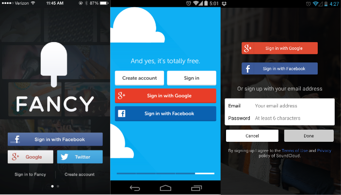

# Social Logins

Social Logins sind in praktisch jeder App zu finden. Immer öfter machen es sich Entwickler einfach und implementieren gar keine eigene Logins mehr.

Die grossen Sozialen Netzwerke unterscheiden sich dabei nicht gross. Dem Benutzer soll das Login resp. die Registrierung mit Hilfe dieses Buttons massiv vereinfacht werden. Auch mit Ionic resp. Ionic Cloud lassen sich Social Logins exzellent in eine hybride App einbauen. Die jeweiligen Anleitungen der drei grossen Player findest du hier:

* [Facebook](https://docs.ionic.io/services/auth/facebook-native.html)
* [Twitter](https://docs.ionic.io/services/auth/twitter-auth.html)
* [Google](https://docs.ionic.io/services/auth/google-native.html)

## **Authentisierungs** - Prozess

Anbei eine grafische Übersicht des Authentisierungs-Prozesses:

1. User besucht die Seite/app und klickt auf "Login mit Facebook"
2. Benutzer wird via App zum Facebook Auth-Dialog weitergeleitet \(Gibt Email/Passwort ein\)
3. Benutzer wird zurück zur App geleitet nachdem er "Erlauben" geklickt hat
4. Unsere App spricht mit Facebook
5. Facebook gibt unser App Informationen zum User

{% embed data="{\"url\":\"https://www.youtube.com/watch?v=uUMp7qcHhIc\",\"type\":\"video\",\"title\":\"\",\"icon\":{\"type\":\"icon\",\"url\":\"https://www.youtube.com/yts/img/favicon\_144-vfliLAfaB.png\",\"width\":144,\"height\":144,\"aspectRatio\":1},\"thumbnail\":{\"type\":\"thumbnail\",\"url\":\"https://i.ytimg.com/vi/uUMp7qcHhIc/maxresdefault.jpg\",\"width\":1280,\"height\":720,\"aspectRatio\":0.5625},\"embed\":{\"type\":\"player\",\"url\":\"https://www.youtube.com/embed/uUMp7qcHhIc?rel=0&showinfo=0\",\"html\":\"
<iframe src=\\\"https://www.youtube.com/embed/uUMp7qcHhIc?rel=0&amp;showinfo=0\\\" style=\\\"border: 0; top: 0; left: 0; width: 100%; height: 100%; position: absolute;\\\" allowfullscreen scrolling=\\\"no\\\"></iframe>
\",\"aspectRatio\":1.7778}}" %}

## Übung

1. Ich weiss die Zeit ist knapp, aber wie Social Logins in etwa funktionieren sollte man schon wissen.
2. Lies die Firebase Dokumentation z.B. zum [Social Login mit Facebook](https://firebase.google.com/docs/auth/web/facebook-login?authuser=0) durch
3. Versuche anhand der Doku, für deine eigene App-Idee die nötigen Schritte zu machen
4. Dabei wirst du einige Einstellungen auch auf Facebook machen müssen

