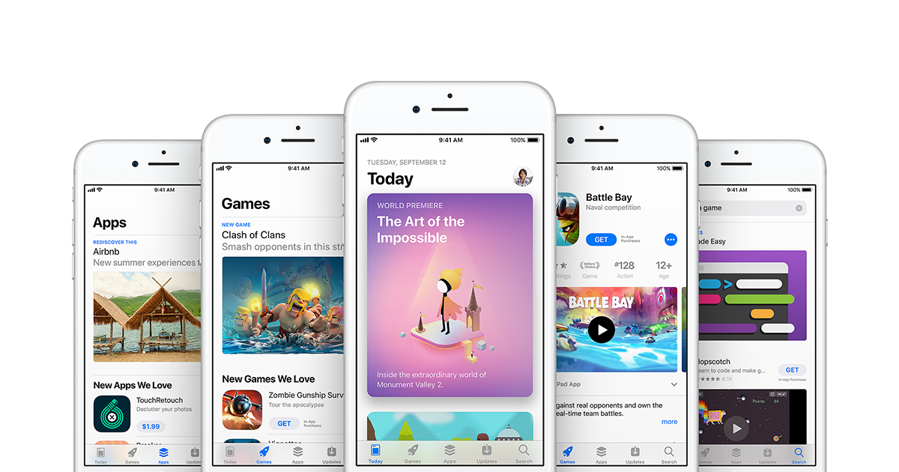
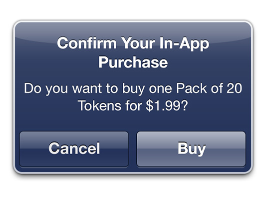

# App Store

> App Store (aus der englischen Kurzform für application „Anwendungssoftware“ und Store „Geschäft“; auch App Market, App-Marktplatz) ist die Bezeichnung für eine Internet-basierte digitale Vertriebsplattform für Anwendungssoftware. Die Software stammt entweder vom Betreiber der Plattform selbst, meist aber überwiegend von Drittanbietern wie etwa freien Softwareentwicklern und Softwareunternehmen. Der Dienst ermöglicht es Benutzern, Software für Mobilgeräte wie Smartphones und Tablets, bei manchen Angeboten auch für andere Geräte, wie zum Beispiel Personal Computer, aus einem Katalog herauszusuchen und herunterzuladen.

_Quelle:_ [_https://de.wikipedia.org/wiki/App\_Store_](https://de.wikipedia.org/wiki/App\_Store)

## Die wichtigsten Links

| Apple App Store                                           | Google Play Store                                      |
| --------------------------------------------------------- | ------------------------------------------------------ |
| [Public](https://itunes.apple.com/ch/genre/ios/id36?mt=8) | [Public](https://play.google.com/store/apps?hl=de)     |
| [Entwickler](https://developer.apple.com)                 | [Entwickler](https://developer.android.com/index.html) |

Um eine App zu veröffentlichen, sollte man die folgenden (ausgedruckt mehrere 100 Seiten) grosse Tutorials anschauen:

* [Google Essentials Guide](https://developer.android.com/distribute/essentials/index.html)
* [Apple Human Interface Guide](https://developer.apple.com/ios/human-interface-guidelines/overview/design-principles/)

## In-App-Käufe

 Als In-App-Käufe werden Käufe bezeichnet, die innerhalb einer App, bzw. für eine App, getätigt werden. Gegenstand solcher In-App-Käufe sind meist Erweiterungen für die App oder andere Zusatzinhalte, wie bspw. die Freischaltung von zusätzlichen Funktionen, virtuelles Geld oder das Freischalten bestimmter Elemente in einem Spiel. Solche Käufe können i.d.R. über einen App Store getätigt werden, oder alternativ über eine eigene Funktion des App-Erstellers.

\
Lading&#x20;

