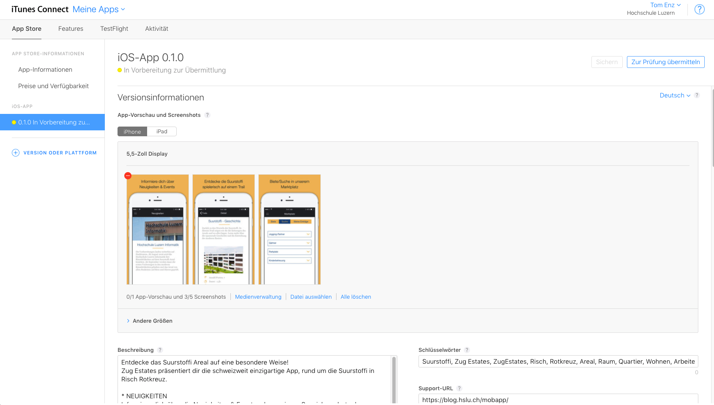
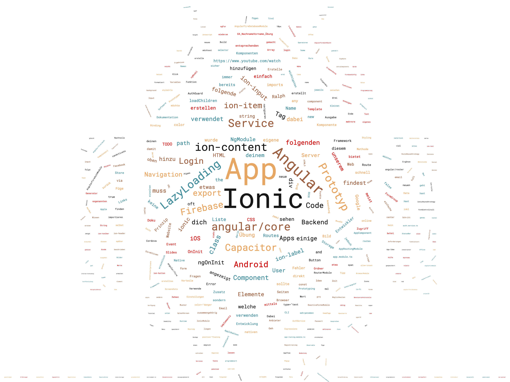

# Build, Veröffentlichung, Ausblick

## Build

### Windows



### macOS



## Veröffentlichung

Ist deine App fertig programmiert heisst das noch lange nicht, dass Sie bereits im Store ist. Die Veröffentlichung kann unter Umständen noch einiges an Zeit in Anspruch nehmen. Hier einige Tipps:

### Approval

Anbei ist der Apple Approval Prozess beschrieben:  

Die Website von [http://appreviewtimes.com/](http://appreviewtimes.com/) zeigt dir die aktuellen Wartezeiten von einem Apple Approval. Bei Releases von neuen Software-Versionen oder Feiertagen arbeiten auch nicht alle Mitarbeiter bei Apple/Google - was eine längere Wartezeit mit sich bringen kann.

Um deine App in den Stores zu veröffentlichen brauchst du mindestens noch folgende Informationen:

* Titel der App im Store
* Schlagwörter
* App-Screenshots
* Textuelle Beschreibung der App
* Evt. Testaccounts für Review

#### App Icon

Hast du deine eigene Idee zur App gemacht, dann wirst bei der Wahl des Icons noch flexibel sein. In Projekten oder in Firmen gelten oft klare CI/CD-Guides, welchen du dich als Entwickler fügen musst.  
Manchmal ist ein einfaches Icon sehr Nahe. Als Beispiel hier die Suurstoffi-App. Die Sauerstoff-Blasen der Schriftart "Bubbles" wurden in Form des Buchstaben "S" dargestellt:  

Im Internet gibt es sehr viele Tools, welche Euch eine Vorlage für Photoshop/Sketch zur Verfügung stellen. Die Grössen der App-Icons variieren je nach Plattform und sind den jeweiligen Dokumentationen zu entnehmen. Ich habe mit folgender Vorlage \(inzwischen kostenpflichtig\) sehr gute Erfahrungen gemacht:



Solltest du dein Icon in verschiedenen Grössen brauchen, hier eine super Seite um in die gängigsten Grössen zu konvertieren:



Hast du kein Adobe Photoshop oder sonstige kostenpflichtige Programme. Hier ist ein gutes Online Bildbearbeitungsprogramm:





#### App Screenshots

Bilder oder in unserem Falle Screenshots deiner App sagen bekanntlich mehr als 1000 Worte. Screenshots deiner App sind Pflicht im Store und deine Visitenkarte. Mit Hilfe der Jungs von Launchkit kann man sich Kostenpflichtig schöne Screenshots erstellen lassen:  
[https://launchkit.io/](https://launchkit.io/)

Weiter macht es Sinn die Screenshots für eine Präsentation oder die Website in eine schöne Umgebung zu packen. Der Service von MockDrop bietet dir diese Möglichkeit. Mit Emotionen lässt sich eine App viel besser verkaufen.









## Landing Page

Ein cooles Repo um eine einfache App Landing Page auf Github zu hosten.



### Versionierung

In der Praxis werden dann oft mehrere Versionen und Builds einer App generiert. Es gibt dazu coole CI/CD Tools wie Fastlane, möchte man es aber im kleinen Rahmen halten müssen mindest jeweils folgende Dateien angepasst werden:

* config.xml
* package.json
* evt. src/environments/environment.ts

Um diesen Vorgang etwas zu vereinfachen, hier ein kleine Hilfestellung:



### AGB's / Terms of Use / Datenschutz

Der rechtliche Aspekt einer App wird oft stark vernachlässigt. Speicherst du Daten eines Benutzer \(Email/Passwort\)? Sind Daten deiner App auf einem Server im Ausland \(USA\) gespeichert? Stell dir diese Fragen doch bevor du vor einem Richter sitzt und für Millionen angeklagt wirst. 😅  
Ein Link für gute AGB's gibt's hier:  
[http://www.schweizer-vertraege.ch/Suchbegriff/60-AGB](http://www.schweizer-vertraege.ch/Suchbegriff/60-AGB)

#### Copyright

Bitte beachtet und respektiert dass im Internet schon sehr viel geklaut wird. Eine Linksammlung für gute Bilder, Illustrationen gibts hier:



### Übung

1. Erstell nun einige Screenshots deiner eigenen \(UseCase 1\) App-Idee. 
2. Verwende die Screenshots um nun mit dem Service [Mockdrop.io](http://mockdrop.io/) ein cooles Bild deiner App zu erzeugen. Zusatz: Such dir ein passendes Screenshot-Template wie launchkit.io resp. ein passendes App-Icon 
3. Geh via [Moodle](https://www.gitbook.com/book/motzne/ict-bz-modul-335/edit#) -&gt; Nützliche Links auf den entsprechenden Ordner _"Tag5/Teil66\_Veröffentlichung"_

   und öffne die Datei online.

4. Erstelle für deine App einen neuen Slide. Der Titel soll beinhalten: Name deiner App / Nachname Vorname \(z.B. Roomies / Roomies Ralph\).
5. Ergänze den Slide mit dem Export von Mockdrop.io 
6. Wir besprechen die Apps im Plenum.

## Ausblick

### Gute Links







### Aktuelles





## Feedback

