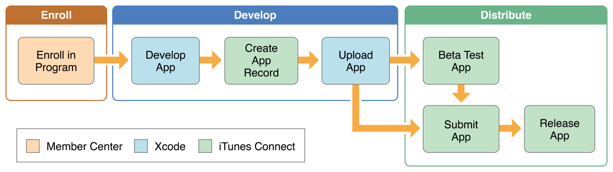
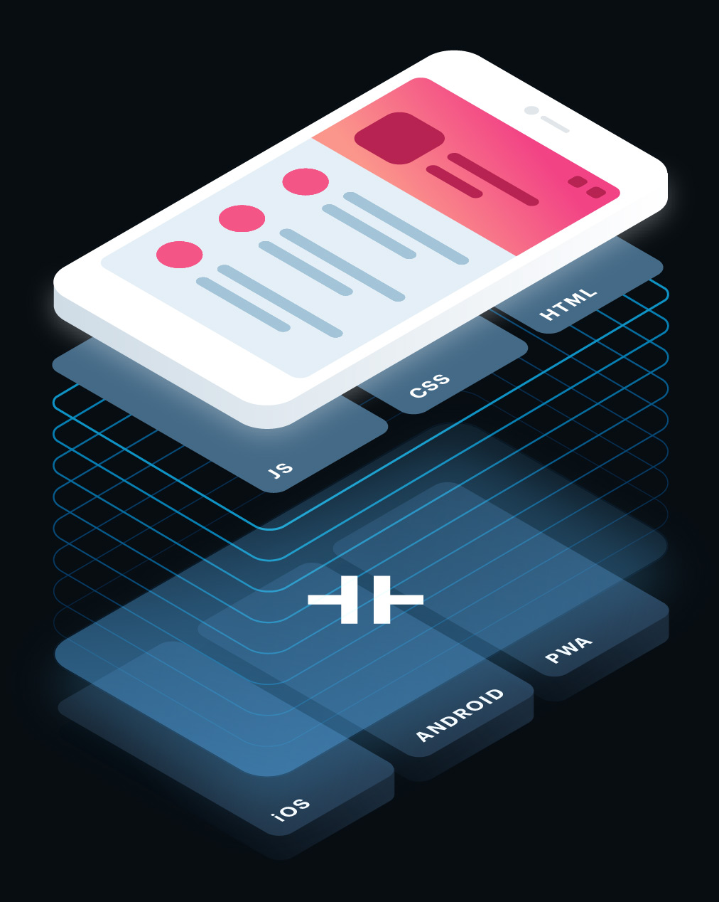

# Veröffentlichung, Ausblick

## Veröffentlichung

Ist deine App fertig programmiert heisst das noch lange nicht, dass Sie bereits im Store ist. Die Veröffentlichung kann unter Umständen noch einiges an Zeit in Anspruch nehmen. Hier einige Tipps:

### Approval

Anbei ist der Apple Approval Prozess beschrieben:  


Die Website von [http://appreviewtimes.com/](http://appreviewtimes.com/) zeigt dir die aktuellen Wartezeiten von einem Apple Approval. Bei Releases von neuen Software-Versionen oder Feiertagen arbeiten auch nicht alle Mitarbeiter bei Apple/Google - was eine längere Wartezeit mit sich bringen kann.

Um deine App in den Stores zu veröffentlichen brauchst du mindestens noch folgende Informationen:

* Titel der App im Store
* Schlagwörter
* App-Screenshots
* Textuelle Beschreibung der App
* Evt. Testaccounts für Review


#### App Icon

Hast du deine eigene Idee zur App gemacht, dann wirst bei der Wahl des Icons noch flexibel sein. In Projekten oder in Firmen gelten oft klare CI/CD-Guides, welchen du dich als Entwickler fügen musst.  
Manchmal ist ein einfaches Icon sehr Nahe. Als Beispiel hier die Suurstoffi-App. Die Sauerstoff-Blasen der Schriftart "Bubbles" wurden in Form des Buchstaben "S" dargestellt:  


Im Internet gibt es sehr viele Tools, welche Euch eine Vorlage für Photoshop/Sketch zur Verfügung stellen. Die Grössen der App-Icons variieren je nach Plattform und sind den jeweiligen Dokumentationen zu entnehmen. Ich habe mit folgender Vorlage \(inzwischen kostenpflichtig\) sehr gute Erfahrungen gemacht:

[https://applypixels.com/](https://applypixels.com/)

#### App Screenshots

Bilder oder in unserem Falle Screenshots deiner App sagen bekanntlich mehr als 1000 Worte. Screenshots deiner App sind Pflicht im Store und deine Visitenkarte. Mit Hilfe der Jungs von Launchkit kann man sich Kostenpflichtig schöne Screenshots erstellen lassen:  
[https://launchkit.io/](https://launchkit.io/)

Weiter macht es Sinn die Screenshots für eine Präsentation oder die Website in eine schöne Umgebung zu packen. Der Service von Mockdrop bietet dir diese Möglichkeit. Mit Emotionen lässt sich eine App viel besser verkaufen.  
[http://mockdrop.io/](http://mockdrop.io/)  
[https://mockuphone.com/](https://mockuphone.com/)

### AGB's / Terms of Use / Datenschutz

Der rechtliche Aspekt einer App wird oft stark vernachlässigt. Speicherst du Daten eines Benutzer \(Email/Passwort\)? Sind Daten deiner App auf einem Server im Ausland \(USA\) gespeichert? Stell dir diese Fragen doch bevor du vor einem Richter sitzt und für Millionen angeklagt wirst. 😅  
Ein Link für gute AGB's gibt's hier:  
[http://www.schweizer-vertraege.ch/Suchbegriff/60-AGB](http://www.schweizer-vertraege.ch/Suchbegriff/60-AGB)

### Übung


1. Erstell nun einige Screenshots deiner eigenen \(UseCase 1\) App-Idee. 
2. Verwende die Screenshots um nun mit dem Service [Mockdrop.io](http://mockdrop.io/) ein cooles Bild deiner App zu erzeugen. Zusatz: Such dir ein passendes Screenshot-Template wie launchkit.io resp. ein passendes App-Icon 
3. Geh via [Moodle](https://www.gitbook.com/book/motzne/ict-bz-modul-335/edit#)  -&gt;  Nützliche Links auf den entsprechenden Ordner _"Tag5/Teil66\_Veröffentlichung"_

   und öffne die Datei online.

4. Erstelle für deine App einen neuen Slide. Der Titel soll beinhalten: Name deiner App / Nachname Vorname \(z.B. Roomies / Roomies Ralph\).
5. Ergänze den Slide mit dem Export von Mockdrop.io 
6. Wir besprechen die Apps im Plenum.

## Ausblick

### PWA

### Ionic 4
- Änderungen von NavController zum [Angular Routing](https://www.joshmorony.com/converting-ionic-3-push-pop-navigation-to-angular-routing-in-ionic-4/)
- [und vieles mehr ...](https://www.joshmorony.com/what-to-expect-when-ionic-4-is-released/)

### Angular 6
- Mehrheitlich Verbesserungen für Entwickler
- Angular Material Starter Components
- Service muss nicht mehr im ```app.module.ts``` registriert werden [(Dependency Injection)](https://angular.io/guide/dependency-injection)
- Längerer LTS-Support
- [und vieles mehr...](https://blog.angular.io/version-6-of-angular-now-available-cc56b0efa7a4)

### Capacitor

[https://capacitor.ionicframework.com/](https://capacitor.ionicframework.com/)


### Ionicons v4

- Die Icons kommen neu als Web-Components daher
- Mit der Intersection Observer API werden Icons nur noch geladen wenn Sie sichtbar werden (super lazy) 
- Man kann ein einges SVG zu Ionicons hinzufügen


### Apple WWDC18
Apple hat an der WWDC 2018 vorgestellt, dass Web-Inhalt nun auch auf der Apple Watch (mit watchOS 5) kommen wir. Wir sind gespannt in welche Richtung das gehen wird... 